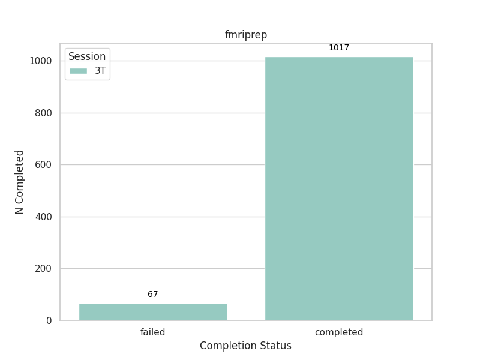
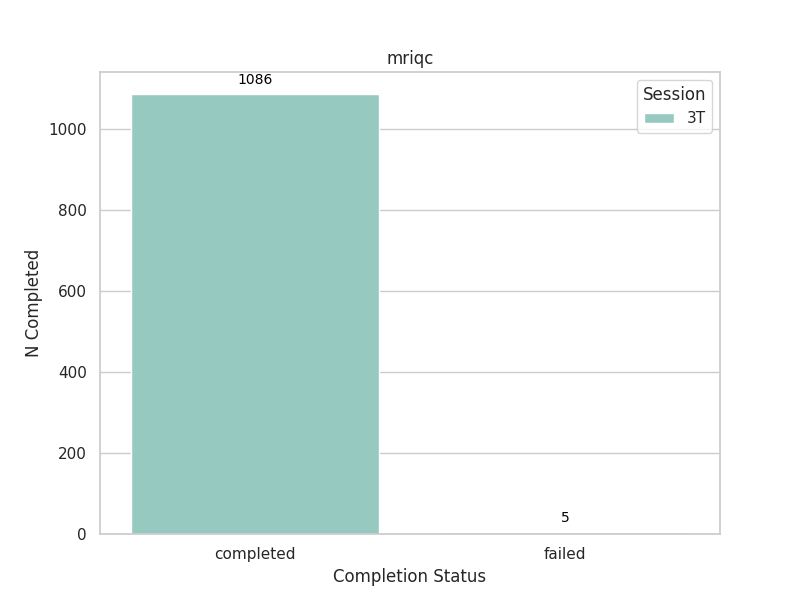
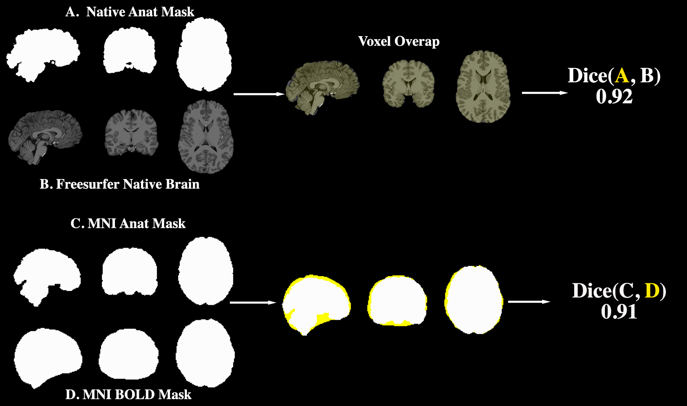

# HCP-Young Adult: MRIQC & FMRIPrep Preprocessing Pipeline

This repository contains the scripts and configurations required for preprocessing fMRI data using **fMRIPrep** and **MRIQC**. The pipeline is for the [Human Connectome Project (HCP) Young Adult (HCP-YA) sample](https://www.humanconnectome.org/#promo-1-content)

As of October 8, 2024, the pipeline uses fMRIPrep [v24.0.1](https://pypi.org/project/fmriprep/24.0.1/) and MRIQC [v23.1.0](https://pypi.org/project/mriqc/23.1.0/)

## Repository Structure

```bash
├── README.md                 # General overview of the project
└── scripts/                  # Scripts and configurations for data preprocessing
    ├── config.json           # This is the main configuration to set input/output paths, specs and file names
    ├── fmriprep/             # [COMING SOON] Scripts to run batch preprocessing base on run files and log into output files
    │   ├── README.md         
    │   ├── dataset_description.json
    │   ├── misc/             # Miscellaneous scripts (e.g., sbatch scripts, data checks)
    │   ├── post_preprocessing_checks/  # Scripts to validate validating fmriprep outputs and check subs on s3
    │   ├── rerun_altfreesurfer/        # When freesurfer fails (based on checks and others) rerun freesufer here
    ├── mriqc/                # Scripts to run batch preprocessing base on run files and log into output files
    │   ├── README.md         
    │   ├── group_mriqc/      # Group-level MRIQC results
    │   └── review_results/   # reviewing results / completion on s3
```

### Key Components

- **fMRIPrep**:
    - Includes sbatch scripts, session management and rerun scripts to handle preprocessing for different arms and timepoints (in HCP-YA it is only session `3T`)
    - Post-processing checks include scripts to compare outputs, review similarity of outputs and confirm S3 subject uploads.
  
- **MRIQC**:
    - Handles both individual and group-level quality control checks for MRI scans. The output includes QC metrics in `.tsv` format for different modalities (T1w, T2w, BOLD).
    - MRIQC rerun scripts and failure handling are also provided.

### Usage

1. Update the configuration in `config.json` specific to your file names/sessions/folder/bucket input.
2. Use the appropriate sbatch scripts `./submit_*` in the `fmriprep/` or `mriqc/` directories to submit preprocessing jobs.
3. Review the outputs using the post-processing checks and QC scripts provided in the `post_preprocessing_checks/` and `review_results/` folders.


This code base is continued to be modified to make submission and QA more efficient.

## Subject Progress

Below is a progress report for the number of subjects marked as "completed" or "failed" for submitted sbatch fMRIprep/MRIQC jobs.

### fMRIPrep
Below is the completion rate of HCP-YA subjects for fMRIPrep. For a more detailed report and description, see the [fMRI folder](./scripts/fmriprep/)



### MRIQC
Below is the completion rate of HCP-YA subjects for MRIQC. For a more detailed report and description, see the [mriqc folder](./scripts/mriqc/)
<div style="text-align: center;">
  
</div>


## Subject QC

Some low cost, manual quality control checks are performed. These are used to evaluate how fMRIPrep performed and how task events align with BOLD signal.

The fMRIPrep results check:

1. What tasks and runs per subject are included in fMRIPrep reports
2. What type of fieldmap correction is used (real fieldmap or synthetic fieldmap)
3. The similarity between the freesurfer brain and subjects' native space anat mask generated by fMRIPrep. Illustration in figure below (A/B).
4. The similarity between the subjects' MNI space anat mask and the BOLD mask, for each task and run, generated by fMRIP. Illustration in figure below (C/D)

<div style="text-align: center;">
  
</div>

Events by BOLD alignment.

