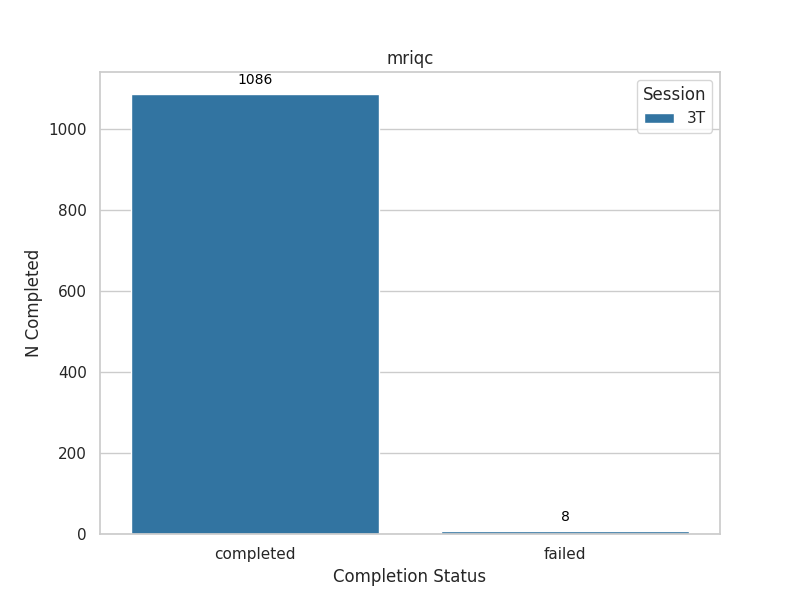

# HCP-Young Adult: MRIQC & FMRIPrep Preprocessing Pipeline

This repository contains the scripts and configurations required for preprocessing fMRI data using **fMRIPrep** and **MRIQC**. The pipeline is for the [Human Connectome Project (HCP) Young Adult (HCP-YA) sample](https://www.humanconnectome.org/#promo-1-content)

As of October 8, 2024, the pipeline uses fMRIPrep [v24.0.1](https://pypi.org/project/fmriprep/24.0.1/) and MRIQC [v23.1.0](https://pypi.org/project/mriqc/23.1.0/)

## Repository Structure

```bash
├── README.md                 # General overview of the project
└── scripts/                  # Scripts and configurations for data preprocessing
    ├── config.json           # This is the main configuration to set input/output paths, specs and file names
    ├── fmriprep/             # [COMING SOON] Scripts to run batch preprocessing base on run files and log into output files
    │   ├── README.md         
    │   ├── dataset_description.json
    │   ├── misc/             # Miscellaneous scripts (e.g., sbatch scripts, data checks)
    │   ├── post_preprocessing_checks/  # Scripts to validate validating fmriprep outputs and check subs on s3
    │   ├── rerun_altfreesurfer/        # When freesurfer fails (based on checks and others) rerun freesufer here
    ├── mriqc/                # Scripts to run batch preprocessing base on run files and log into output files
    │   ├── README.md         
    │   ├── group_mriqc/      # Group-level MRIQC results
    │   └── review_results/   # reviewing results / completion on s3
```

## Key Components

### fMRIPrep
- **Scripts and Session Management**: Includes `sbatch` scripts, session management, and rerun scripts for preprocessing across different arms and timepoints (HCP-YA includes only session `3T`).
- **Post-Processing Checks**: Scripts compare outputs, assess similarity, and confirm S3 subject uploads.

### MRIQC
- **Quality Control**: Performs individual and group-level quality control checks for MRI scans. Outputs QC metrics in `.tsv` format for modalities such as T1w, T2w, and BOLD.
- **Error Handling**: Includes rerun scripts and mechanisms for managing failed processes.

## Usage

1. Update the configuration file (`config.json`) with your specific filenames, sessions, folders, and bucket paths.
2. Submit preprocessing jobs using `sbatch` scripts located in the `fmriprep/` or `mriqc/` directories (e.g., `./submit_*`).
3. Review outputs using the post-processing and QC scripts available in `post_preprocessing_checks/` and `review_results/`.

This codebase is continuously refined for more efficient submission and QA processes.

## Subject Progress

### fMRIPrep
The following chart illustrates the completion rate of HCP-YA subjects for fMRIPrep. Detailed reports and descriptions are available in the [fMRI folder](./scripts/fmriprep/).


### MRIQC
The completion rate of HCP-YA subjects for MRIQC is shown below. Detailed reports and descriptions are available in the [MRIQC folder](./scripts/mriqc/).

<div style="text-align: center;">
  
</div>

## Subject QC

Low-cost manual quality control checks evaluate fMRIPrep results and the alignment of task events with BOLD signals. Distributions are plotted in the [fMRI README file](./scripts/fmriprep/README.md).

### fMRIPrep Results Check
1. Verify tasks and runs included in fMRIPrep reports.
2. Confirm the type of fieldmap correction used (real or synthetic fieldmap).
3. Assess:
   - Similarity between Freesurfer brain and the subject's native-space anatomical mask generated by fMRIPrep (illustrated below: A/B).
   - Similarity between the subject's MNI-space anatomical mask and BOLD mask for each task and run (illustrated below: C/D).

<div style="text-align: center;">
  
</div>

**Alignment of BOLD and Events**
Peristimulus plots are generated using `masked_timeseries` from the [PyReliMRI package](https://pyrelimri.readthedocs.io/en/latest/timeseries_extract.html). The script [create_peristim.py](./scripts/fmriprep/post_preprocessing_checks/qc_sdc-similarity/create_peristim.py) performs the following:

- Masks timeseries from motor task runs (up to 2) using left visual MNI coordinates from Neurosynth (8mm; -6,-90,-2).
- Applies smoothing (4mm FWHM Gaussian kernel), detrending, high-pass filtering (1/90 Hz), and percent signal change conversion using [Nilearn's NiftiMasker](https://nilearn.github.io/dev/modules/generated/nilearn.maskers.NiftiMasker.html).
- Align timeseries to cue onset using bankers method.

**Rationale for Visual Regions**
- Cues are presented for 3 seconds during each trial in motor task runs ([Barch et al., 2013](https://www.sciencedirect.com/science/article/pii/S1053811913005272)).
- Motor regions lack sufficient trial-by-trial power due to limited trials per response type.
- Visual regions offer sufficient power because each motor trial is preceded by a visual cue.

**Peristimulus Plot Workflow**
- Generate TR-by-TR plots for 24 TRs post-cue (17.3 seconds), averaging across 10 trials and 2 runs.
- Estimate the mean signal maximum (hashed blue line in example) within the first 15 TRs (10.8 seconds, highlighted in gray) and visualize distributions.

<div style="text-align: center;">
  
</div>