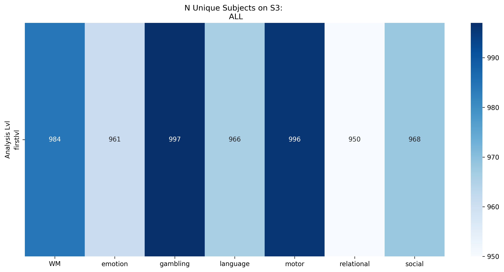

# HCP-YA Processing Workflow

Curated by: Michael Demidenko
Last Updated: 04/16/2025

## Overview
The reports and documentation in this repository outlines the end-to-end processing workflow for the Human Connectome Project Young Adult (HCP-YA) dataset. Starting from the BIDS-formatted data, produces derivatives for both resting-state connectivity (in surface space) and task-based activation analysis (in volumetric space).

The workflow encompasses:

1. **Quality Control** (MRIQC) - Reports of image quality metrics
2. **Preprocessing** (fMRIPrep) - Preprocessing of anatomical and functional data
3. **Post-processing** (XCP-D) - Denoising and preparation of [surface-based] connectivity analyses
4. **Task Event Conversion** - Transformation of [raw] E-Prime behavioral data into BIDS-compatible `*_events.tsv` files with associated json descriptor
5. **Task GLM Analysis** - First-level and subject-level activation models for all HCP tasks, computed regressor/contrast variance inflation factors, r-squared maps and residual connectivity matrices for HCP and an Alt GLM model.

As of April 2025, the pipeline utilizes:
- fMRIPrep v24.0.1
- MRIQC v23.1.0
- XCP-D v0.9.0
- Nilearn v0.10.3

## Purpose

This workflow serves multiple purposes:

- **Data Quality Assessment**: Enables users to evaluate quality and identify problematic acquisitions for exclusion.
- **Standardized Preprocessing**: Consistent preprocessing to minimize methodological variability.
- **Enhanced Task Analysis**: Provides standardized GLM results and event files with detailed trial-level information and an alternative model than [Barch et al. 2013](https://www.sciencedirect.com/science/article/pii/S1053811913005272)
- **Reproducibility**: Ensures all processing steps are documented and replicable

The pipeline supports the complete HCP-YA dataset with over 1,000 subjects and handles all seven HCP tasks (EMOTION, MOTOR, RELATIONAL, SOCIAL, WM, GAMBLING, LANGUAGE). The workflow also includes a comprehensive quality control steps at each stage, verifying anatomical/functional alignment, fieldmap correction, event/BOLD synchronization (motor task), and adequate brain coverage for reliable statistical analysis.

## Repository Structure

```bash
├── README.md                 # General overview of the project
└── scripts/                  # Scripts and configurations for data processing
    ├── config.json           # Main configuration to set input/output paths, specs, and filenames
    ├── fmriprep/             # Scripts for preprocessing fMRI data
    │   ├── README.md         
    │   ├── dataset_description.json
    │   ├── misc/             # Miscellaneous scripts (e.g., sbatch scripts, data checks)
    │   ├── post_preprocessing_checks/  # Scripts to validate fMRIPrep outputs and check subs on S3
    │   ├── rerun_altfreesurfer/        # Scripts to rerun FreeSurfer when failures occur
    ├── mriqc/                # Scripts for MRI quality control
    │   ├── README.md         
    │   ├── group_mriqc/      # Group-level MRIQC results
    │   └── review_results/   # Reviewing results/completion on S3
    ├── xcpd/                 # Scripts for postprocessing fMRI data
        ├── README.md
        ├── dataset_description.json
    ├── taskevents/                 # Scripts for converting e-prime data to events.tsv
        ├── README.md
        ├── download_eprimehcp.py   # Script to download e-prime data from AWS for HCP
        ├── preproc_taskeprime.py   # Script to clean and extract onsets, durations, trial and behavioral information
        ├── preproc_util.py         # functions to label blocks and extract task-specific details
        ├── info_*/                 # task details / summaries
        ├── imgs/                   # descriptives of task events
    ├── taskbold/                   # Scripts for to fit subject- and group-level GLM models for HCP tasks
        ├── README.md
        ├── input_taskmodel.json    # Specific task specific information for glm scripts. Included specifying contrasts of interest
        ├── grp_conscoords.json     # Specific group map values used in group average plotting and contrast reporting
        ├── glm_utils.py            # Functions for running / reporting model details
        ├── prep_eventsdata.py      # Functions to prepare behavioral data prior to model fits
        ├── run_subjectmodels.py    # Script to compute run- and subject-level models, extract timeseries data from residuals and estimate coverage
        ├── pilot_bold-models.ipynb # Playground for HCP task data prep and fitting models
        ├── template.glms           # templates .sh runs to run glms 
        ├── make_glmjobs.sh         # Make glm runs for HPC based off of template
        ├── submit_glmjobs.sh       # sbatch script to run glm runs on HPC
        ├── imgs/                   # descriptives of files on s3 / computed from HPC runs / group maps and example design+VIF

```

## Rerunning Workflow: Usage

The workflows leverages `singularity` containers for MRIQC/fMRIPrep/XCP-D, `s3` buckets and client, High-performance Computers, and `uv` python environment manager for task events and task BOLD analyses.   

1. **Clone the repository**:
   ```bash
   git clone https://github.com/demidenm/hcpya_preprocess.git
   ```
2. **Set up environment**:
   ```bash
   bash setup_uv.sh
   ```
3. Update the configuration file (`config.json`) with your specific filenames, sessions, folders, and bucket paths.
4. Submit preprocessing jobs using `sbatch` scripts located in the `fmriprep/`, `mriqc/`, `xcp_d/`, `tasbold` directories (e.g., `./submit_*`).
5. Review outputs using the post-processing and QC scripts available in `post_preprocessing_checks/` and `review_results/` for fMRIPrep.

## Key Outputs

### fMRIPrep

**Bucket size**: 28 TB
**Quantity Objects**: 1,073,009

- **Scripts and Session Management**: Includes `sbatch` scripts, session management, and rerun scripts for preprocessing across different arms and timepoints (HCP-YA includes only session `3T`).
- **Post-Processing Checks**: Scripts compare outputs, assess similarity, and confirm S3 subject uploads.

### MRIQC

**Bucket size**: 342 GB
**Quantity Objects**: 223,678

- **Quality Control**: Performs individual and group-level quality control checks for MRI scans. Outputs QC metrics in `.tsv` format for modalities such as T1w, T2w, and BOLD.
- **Error Handling**: Includes rerun scripts and mechanisms for managing failed processes.

### XCP-D

**Bucket size**: 6 TB
**Quantity Objects**: 434,882

- **Postprocessing Pipeline**: Uses **XCP-D v0.9.0** to generate postprocessed derivatives for resting-state fMRI, including denoised BOLD signals, bandpass-filtered data, and motion-parameter filtering.

### E-Prime to Events.tsv

**Folder size**: 562 MB
**Quantity Objects**: 14,545

This part of the repository contains scripts for downloading and converting Human Connectome Project (HCP) E-Prime task data into BIDS-compatible event files.
Key Features

- AWS Setup: Instructions for configuring AWS credentials to access the HCP S3 bucket
- Automated Downloading: Parallel download of E-Prime data files from HCP-1200 dataset (~1000+ subjects, 7 tasks, 2 runs each)
- BIDS Conversion: Transforms raw E-Prime task data into standardized BIDS events.tsv files
- Task Support: Processes data for all major HCP tasks (EMOTION, MOTOR, RELATIONAL, SOCIAL, WM, GAMBLING, LANGUAGE)

### Task BOLD Models

**Folder size**: 1.6 TB
**Quantity Objects**: 837,781

This part of the repository contains the scripts for preparing the events data for modeling, running the run-level and subject-level contrast maps (beta, variance, z-score), extracting model R-squared maps and residual variance timeseries for the two models.

## Subject Progress

### MRIQC
The completion rate of HCP-YA subjects for MRIQC is shown below. Detailed reports and descriptions are available in the [MRIQC folder](./scripts/mriqc/).

<div style="text-align: center;">
  
</div>

### fMRIPrep
The following chart illustrates the completion rate of HCP-YA subjects for fMRIPrep. Detailed reports and descriptions are available in the [fMRI folder](./scripts/fmriprep/).


### XCP-D
The completion rate of HCP-YA subjects for XCP-D is shown below. Detailed reports and descriptions are available in the [XCP-D folder](./scripts/xcp_d/). 

<div style="text-align: center;">
  
</div>

### Task BOLD GLMs
The model specifics and additional details about the HCP-YA GLM models are available in the [Task BOLD folder](./scripts/taskbold/). Below, are surface level completition rates for the first-level (run-level) and fixed-effect (within-subect) models across the seven HCP tasks. Subject runs were not computed if they had insufficient brain coverage with the target MNI152 mask and fixed effect models were not feasible if only a single run was available. Some subjects failed because singular value decomposition errors at the first level, which was N<5 per task


<div style="text-align: center;">
  
</div>


## Subject QC

Low-cost manual quality control checks evaluate fMRIPrep results and the alignment of task events with BOLD signals. Distributions are plotted in the [fMRI README file](./scripts/fmriprep/README.md).

### fMRIPrep Results Check
1. Verify tasks and runs included in fMRIPrep reports.
2. Confirm the type of fieldmap correction used (real or synthetic fieldmap).
3. Assess:
   - Similarity between Freesurfer brain and the subject's native-space anatomical mask generated by fMRIPrep (illustrated below: A/B).
   - Similarity between the subject's MNI-space anatomical mask and BOLD mask for each task and run (illustrated below: C/D).

<div style="text-align: center;">
  
</div>


### Check Event-locked BOLD Timeseries

**Alignment of BOLD and Events**
Peristimulus plots are generated using `masked_timeseries` from the [PyReliMRI package](https://pyrelimri.readthedocs.io/en/latest/timeseries_extract.html). The script [create_peristim.py](./scripts/fmriprep/post_preprocessing_checks/qc_sdc-similarity/create_peristim.py) performs the following:

- Masks timeseries from motor task runs (up to 2) using left visual MNI coordinates from Neurosynth (8mm; -6,-90,-2).
- Applies smoothing (4mm FWHM Gaussian kernel), detrending, high-pass filtering (1/90 Hz), and percent signal change conversion using [Nilearn's NiftiMasker](https://nilearn.github.io/dev/modules/generated/nilearn.maskers.NiftiMasker.html).
- Align timeseries to cue onset using bankers method.

**Rationale for Visual Regions**
- Cues are presented for 3 seconds during each trial in motor task runs ([Barch et al., 2013](https://www.sciencedirect.com/science/article/pii/S1053811913005272)).
- Motor regions lack sufficient trial-by-trial power due to limited trials per response type.
- Visual regions offer sufficient power because each motor trial is preceded by a visual cue.

**Peristimulus Plot Workflow**
- Generate TR-by-TR plots for 24 TRs post-cue (17.3 seconds), averaging across 10 trials and 2 runs.
- Estimate the mean signal maximum (hashed blue line in example) within the first 15 TRs (10.8 seconds, highlighted in gray) and visualize distributions.

<div style="text-align: center;">
  
</div>


### Check XCP-D Outputs

[XCP-D folder](./scripts/xcp_d/) contains summaries of network and cortical thickness estimates. Specifically, across the 17 networks from the [Shaefer 1000 atlas](https://github.com/PennLINC/AtlasPack/blob/main/atlas-4S1056Parcels_dseg.tsv), when the pearson correlation matrices exists for a given subject the aggregate within and between edgewise correlations are calculated. Then, for five separate regions near bordering edges where Freesurfer issues may arise (figure below), cortical thickness estimates are extracted and plotted for each subject. 

<div style="text-align: center;">
  
</div>


### Task BOLD ~ MNI Brain Coverage

[Task BOLD folder](./scripts/taskbold/) contains more information about the models and reports. Below is a figure summarizing the brain coverage between based on Dice coefficient called on the task BOLD run and the MNI brain template.

<div style="text-align: center;">
  
</div>
