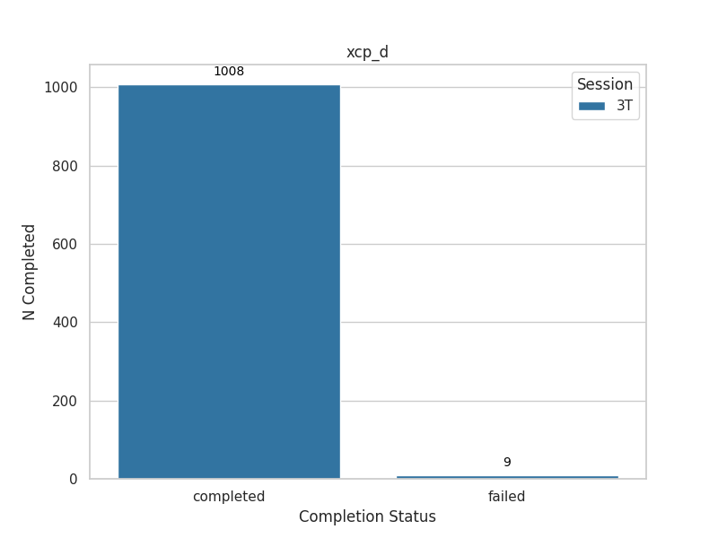
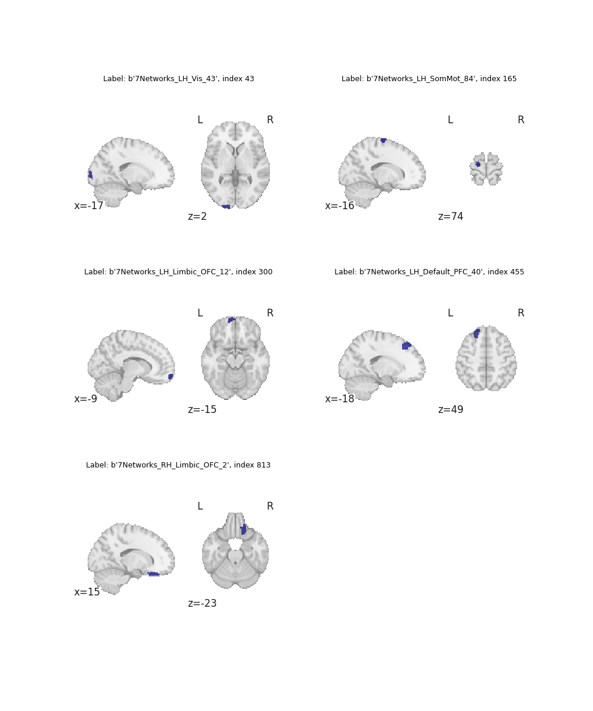

# HCP-Young Adult: MRIQC & FMRIPrep Preprocessing, XCP-D Post-processing Pipeline & E-Prime to Events.tsv

This repository contains the scripts and configurations required for preprocessing fMRI data using **fMRIPrep** and **MRIQC**. The pipeline is for the [Human Connectome Project (HCP) Young Adult (HCP-YA) sample](https://www.humanconnectome.org/#promo-1-content)

As of November 26, 2024, the pipeline uses fMRIPrep [v24.0.1](https://pypi.org/project/fmriprep/24.0.1/), MRIQC [v23.1.0](https://pypi.org/project/mriqc/23.1.0/) & XCP-D [v0.9.0](https://xcp-d.readthedocs.io/en/0.9.0/)

As of March 13, 2025, a pipleine has been included to convert the e-prime task data to events.tsv files. This provide expanded onset, durations and trial- and block-level details.

## Repository Structure

```bash
├── README.md                 # General overview of the project
└── scripts/                  # Scripts and configurations for data processing
    ├── config.json           # Main configuration to set input/output paths, specs, and filenames
    ├── fmriprep/             # Scripts for preprocessing fMRI data
    │   ├── README.md         
    │   ├── dataset_description.json
    │   ├── misc/             # Miscellaneous scripts (e.g., sbatch scripts, data checks)
    │   ├── post_preprocessing_checks/  # Scripts to validate fMRIPrep outputs and check subs on S3
    │   ├── rerun_altfreesurfer/        # Scripts to rerun FreeSurfer when failures occur
    ├── mriqc/                # Scripts for MRI quality control
    │   ├── README.md         
    │   ├── group_mriqc/      # Group-level MRIQC results
    │   └── review_results/   # Reviewing results/completion on S3
    ├── xcpd/                 # Scripts for postprocessing fMRI data
        ├── README.md
        ├── dataset_description.json
    ├── taskevents/                 # Scripts for converting e-prime data to events.tsv
        ├── README.md
        ├── download_eprimehcp.py   # Script to download e-prime data from AWS for HCP
        ├── preproc_taskeprime.py   # Script to clean and extract onsets, durations, trial and behavioral information
        ├── preproc_util.py         # functions to label blocks and extract task-specific details
        ├── info_*/                 # task details / summaries
        ├── imgs/                   # descriptives of task events

```

## Key Components

### fMRIPrep
- **Scripts and Session Management**: Includes `sbatch` scripts, session management, and rerun scripts for preprocessing across different arms and timepoints (HCP-YA includes only session `3T`).
- **Post-Processing Checks**: Scripts compare outputs, assess similarity, and confirm S3 subject uploads.

### MRIQC
- **Quality Control**: Performs individual and group-level quality control checks for MRI scans. Outputs QC metrics in `.tsv` format for modalities such as T1w, T2w, and BOLD.
- **Error Handling**: Includes rerun scripts and mechanisms for managing failed processes.

### XCP-D
- **Postprocessing Pipeline**: Uses **XCP-D v0.9.0** to generate postprocessed derivatives for resting-state fMRI, including denoised BOLD signals, bandpass-filtered data, and motion-parameter filtering.

### E-Prime to Events.tsv

This repository contains scripts for downloading and converting Human Connectome Project (HCP) E-Prime task data into BIDS-compatible event files.
Key Features

- AWS Setup: Instructions for configuring AWS credentials to access the HCP S3 bucket
- Automated Downloading: Parallel download of E-Prime data files from HCP-1200 dataset (~1000+ subjects, 7 tasks, 2 runs each)
- BIDS Conversion: Transforms raw E-Prime task data into standardized BIDS events.tsv files
- Task Support: Processes data for all major HCP tasks (EMOTION, MOTOR, RELATIONAL, SOCIAL, WM, GAMBLING, LANGUAGE)

## Usage

1. Update the configuration file (`config.json`) with your specific filenames, sessions, folders, and bucket paths.
2. Submit preprocessing jobs using `sbatch` scripts located in the `fmriprep/`, `mriqc/` or `xcp_d/` directories (e.g., `./submit_*`).
3. Review outputs using the post-processing and QC scripts available in `post_preprocessing_checks/` and `review_results/` for fMRIPrep.

This codebase is continuously refined for more efficient submission and QA processes.

## Subject Progress

### MRIQC
The completion rate of HCP-YA subjects for MRIQC is shown below. Detailed reports and descriptions are available in the [MRIQC folder](./scripts/mriqc/).

<div style="text-align: center;">
  
</div>

### fMRIPrep
The following chart illustrates the completion rate of HCP-YA subjects for fMRIPrep. Detailed reports and descriptions are available in the [fMRI folder](./scripts/fmriprep/).


### XCP-D
The completion rate of HCP-YA subjects for XCP-D is shown below. Detailed reports and descriptions are available in the [XCP-D folder](./scripts/xcp_d/). 

<div style="text-align: center;">
  
</div>

## Subject QC

Low-cost manual quality control checks evaluate fMRIPrep results and the alignment of task events with BOLD signals. Distributions are plotted in the [fMRI README file](./scripts/fmriprep/README.md).

### fMRIPrep Results Check
1. Verify tasks and runs included in fMRIPrep reports.
2. Confirm the type of fieldmap correction used (real or synthetic fieldmap).
3. Assess:
   - Similarity between Freesurfer brain and the subject's native-space anatomical mask generated by fMRIPrep (illustrated below: A/B).
   - Similarity between the subject's MNI-space anatomical mask and BOLD mask for each task and run (illustrated below: C/D).

<div style="text-align: center;">
  
</div>


### Check Event-locked BOLD Timeseries

**Alignment of BOLD and Events**
Peristimulus plots are generated using `masked_timeseries` from the [PyReliMRI package](https://pyrelimri.readthedocs.io/en/latest/timeseries_extract.html). The script [create_peristim.py](./scripts/fmriprep/post_preprocessing_checks/qc_sdc-similarity/create_peristim.py) performs the following:

- Masks timeseries from motor task runs (up to 2) using left visual MNI coordinates from Neurosynth (8mm; -6,-90,-2).
- Applies smoothing (4mm FWHM Gaussian kernel), detrending, high-pass filtering (1/90 Hz), and percent signal change conversion using [Nilearn's NiftiMasker](https://nilearn.github.io/dev/modules/generated/nilearn.maskers.NiftiMasker.html).
- Align timeseries to cue onset using bankers method.

**Rationale for Visual Regions**
- Cues are presented for 3 seconds during each trial in motor task runs ([Barch et al., 2013](https://www.sciencedirect.com/science/article/pii/S1053811913005272)).
- Motor regions lack sufficient trial-by-trial power due to limited trials per response type.
- Visual regions offer sufficient power because each motor trial is preceded by a visual cue.

**Peristimulus Plot Workflow**
- Generate TR-by-TR plots for 24 TRs post-cue (17.3 seconds), averaging across 10 trials and 2 runs.
- Estimate the mean signal maximum (hashed blue line in example) within the first 15 TRs (10.8 seconds, highlighted in gray) and visualize distributions.

<div style="text-align: center;">
  
</div>


### Check XCP-D Outputs

[XCP-D folder](./scripts/xcp_d/) contains summaries of network and cortical thickness estimates. Specifically, across the 17 networks from the [Shaefer 1000 atlas](https://github.com/PennLINC/AtlasPack/blob/main/atlas-4S1056Parcels_dseg.tsv), when the pearson correlation matrices exists for a given subject the aggregate within and between edgewise correlations are calculated. Then, for five separate regions near bordering edges where Freesurfer issues may arise (figure below), cortical thickness estimates are extracted and plotted for each subject. 

<div style="text-align: center;">
  
</div>
