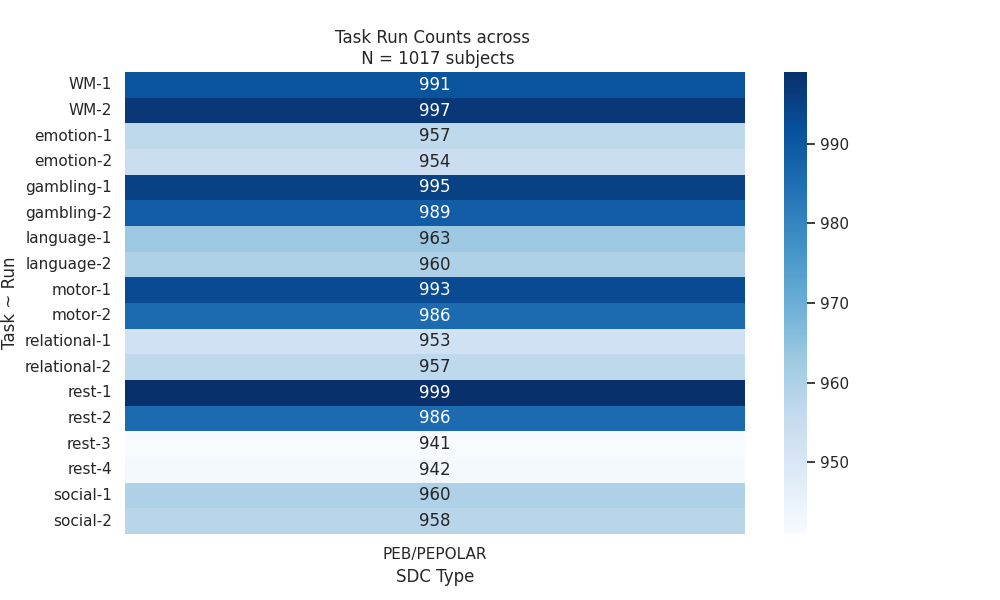
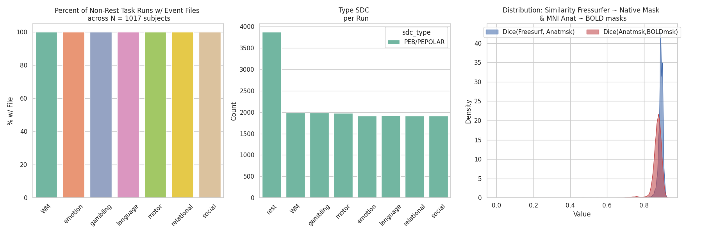
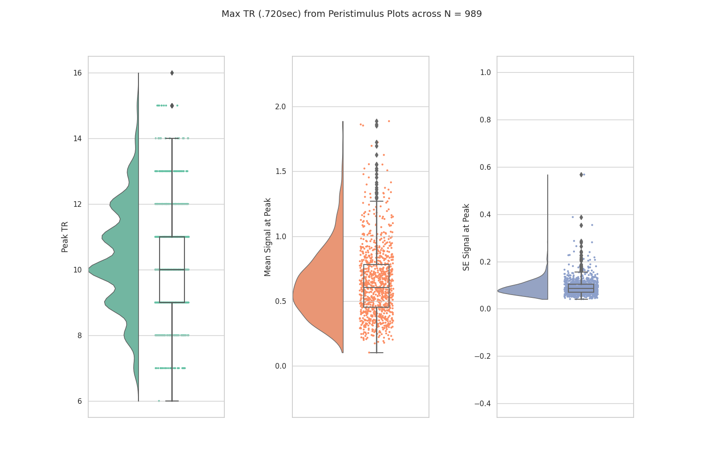

# ABCD-BIDS: FMRIPrep Preprocessing Pipeline

This code is to run fMRIPrep preprocessing. The general overview:

- template.fmriprep
    - This is the template used to copy data to a tmp area to preprocess locally. It also includes the singularity run for fMRIPrep + the sync to s3
- resources_*.sh 
    - This is your research request for each fMRIPrep job that is submitted to slurm (takes 4-7hrs each)
- submit_*.sh 
    - jobs are submitted using arrays indicating the runs in `run_files.*` folder
    - to submit the first 100 subjs for independent slurm jobs use: ./submit_fmriprep.sh 0-100

The `task_list.json` specifies which tasks to run/filter using [BIDS filter file tag](https://fmriprep.org/en/stable/usage.html#:~:text=a%20multiecho%20series-,%2D%2Dbids%2Dfilter%2Dfile,-A%20JSON%20file)

The singularity run is currently templated as:

```bash
singularity run --cleanenv \
    -B "${bids_dir}:/bids_dir" \
    -B "${data_dir}/processed/${fmriprep_ver}/sub-${subj_id}_ses-${ses_id}:/output_dir" \
    -B "${data_dir}/work_dir/${fmriprep_ver}/sub-${subj_id}_ses-${ses_id}:/wd" \
    -B "${freesurfer_license}:/freesurf_license.txt" \
    "${singularity_img}" \
    /bids_dir /output_dir participant \
    --participant-label "${subj_id}" \
    --fs-license-file /freesurf_license.txt \
    --ignore slicetiming \
    --fd-spike-threshold .5 \
    --output-space MNI152NLin2009cAsym:res-2 \
    --cifti-output 91k \
    -vv \
    -w /wd
```

## fMRIPrep Automated QC

Below are some summaries on the fMRIPrep'd results.

### Counts: Runs, Task, SDC

The HCP dataset collections seven separate task and resting state BOLD. The tasks include working memory, emotion, gambling, language, motor, relational and social tasks. Each task has up to two fMRI BOLD runs and the resting state data have up to XX fMRI BOLD runs. fMRIPrep generates an HTML the lists the 1) task name, 2) the run, and 3) the type of signal distortion correction (SDC) that is applied. The counts are plotted across the preprocessed subjects' reports.




### Event Files, SDC Runs, Dice Similarity

The below figure figure summarizes the percent of non-rest task runs that have an associate event file (*_events.tsv), the count of SDC correction across tasks, and the distribution of the similarity (Dice coefficient) for 1) the fMRIPrep produced Freesufer brain-by-native anatomy mask and 2) the MNI anatomy mask-by-MNI BOLD mask (per run and task)




### Peristimulus Results

The below figure summarizes the maximum TR from the peristimulus plots. The maximum TR (.720sec) is the max(value) for the first 15 TRs (10.8sec). The histogram covers the Peak TR value, Mean Signal at the Peak TR and the Standard Eroor at the Peak RT.


