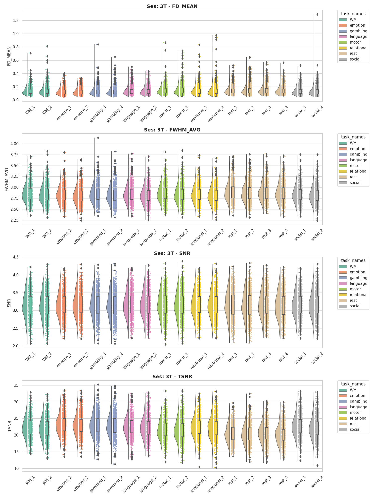
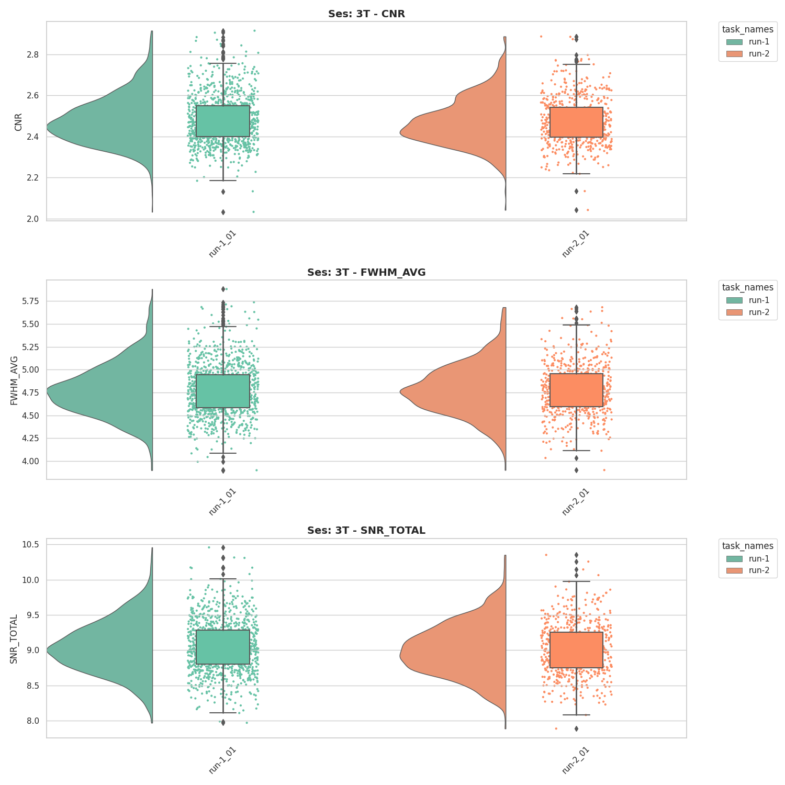
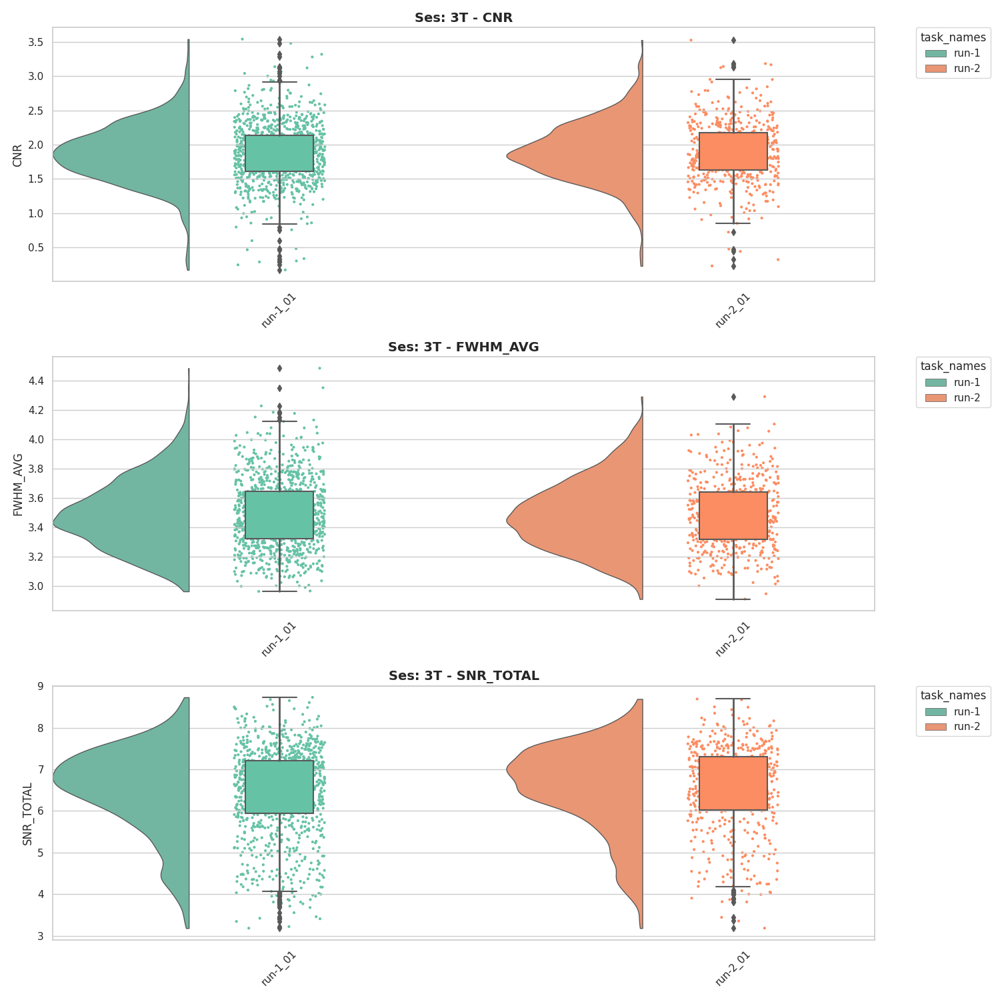

# HCP-YA: MRIQC Preprocessing Pipeline

This code is to run MRIQC preprocessing. The general overview:

- template.mriqc
    - This is the template used to copy data to a tmp area to preprocess locally. It also includes the singularity run for MRIQC + the sync to s3
- resources_*.sh 
    - This is your research request for each MRIQC job that is submitted to slurm (takes ~20-35min each)
- submit_*.sh 
    - jobs are submitted using arrays indicating the runs in `run_files.*` folder
    - to submit the first 100 subjs for independent slurm jobs use: ./submit_mriqc.sh 0-100


The singularity run is currently templated as:

```bash
singularity run --cleanenv \
    -B ${data_dir}/bids_dir/sub-${subj_id}_ses-${ses_id}:/bids_dir \
    -B ${data_dir}/processed/sub-${subj_id}_ses-${ses_id}:/output_dir \
    -B ${data_dir}/work_dir//sub-${subj_id}_ses-${ses_id}:/wd \
    ${sif_img} \
    /bids_dir /output_dir participant \
    --ants-nthreads 12 \
    --nprocs 12 \
    --mem_gb 40 \
    -vv \
    --verbose-reports \
    -w /wd \
    -m bold T1w T2w
```

## BOLD Brief Summaries


## T1w Brief Summaries


## T2w Brief Summaries

