# HCP-YA Task BOLD Modeling

## Summary of Task Modeling Decisions

# Summary of Task Modeling Decisions

Task GLMs were fit for all seven of the HCP tasks using the [fMRIPrep](../fmriprep/) derived MNI152 BOLD and the computed [behavioral events](../taskevents/) files. The summaries below include the model examples and counts of subjects ran for the first and second level models.

General information about subject-level models: Within-run and within-subject models were estimated using Nilearn 0.10.4 [Abraham et al., 2014] in Python 3.9.7. FirstLevel models were computed only if subject-level run data had sufficient brain coverage. To ensure sufficient BOLD coverage in MNI space, a Dice coefficient was calculated to assess the overlap between the binarized `MNI152NLin2009cAsym_res-02` brain template and the subject-specific brain mask derived from the BOLD data. The subject's brain mask was retrieved from the fMRIPrep'd preprocessed data. The Dice coefficient between this brain mask and the reference brain mask (from the standard MNI space) was computed using the image_similarity function in `PyReliMRI`. If coverage was < 70% between the two masks, the first level computation was skipped. This ensured that only valid runs with accurate brain masks were included in the first-level GLM fitting.

For each of the two runs with >70% Dice coefficient, a within-run model was fit using Nilearn's `FirstLevelModel` applied to the subject-specific fMRI time series data. The design matrix included task regressors defined by the `HCP` and `ALT` models, as well as nuisance regressors: cosine basis functions from fMRIPrep corresponding to a 128s highpass filter, and 12 motion-related parameters (three translations, three rotations, and their temporal derivatives). Time series data were pre-whitened using an AR(1) model and spatially smoothed with a 5 mm FWHM Gaussian kernel. For each run and contrast of interest (see [contrast json](./input_taskmodel.json)), Nilearn's `compute_contrast` function was used to derive the contrast estimate (effect size), its associated variance (effect variance) and z-scored statistical maps. Additionally, r-squared and residual variance maps were computed and saved for each run. The residual maps were used to extract correlation matrices from the time series data (described below).

After both runs were processed, fixed effects were computed at the subject level using Nilearn's `compute_fixed_effects` function. This was performed *only* when 1) there were two runs of data and 2) both runs had sufficient brain coverage (as determined by the mask overlap threshold). Fixed effects were computed without enabling the precision_weighted option, resulting in an unweighted average of the run-level contrast estimates.

Parcel-specific timeseries data were extracted from the residual timeseries for both models. First, the residual 4D volumes were saved for each of the two runs across all tasks for the HCP and ALT models. To restrict analyses to voxels with 1) sufficient signal and 2) anatomical plausibility, a subject-specific brain mask was computed by combining functional and anatomical criteria. First, a voxel-wise variance map was generated from the preprocessed BOLD data and binarized to include only non-zero voxels. This reflects regions with temporal variability, as variance for zero values and non-signal voxels would be zero. This was intersected with a binarized probabilistic gray matter segmentation image from the subject's anatomical data (thresholded at >1%). The resulting mask—representing the intersection of non-zero functional variance and gray matter probability—was used to constrain subsequent time series extraction and GLM estimation to relevant brain regions using `NiftiLabelsMasker` for the Schaefer 1000 deterministic atlas and `NiftiMapsMasker` for the Dimuo 1024 probabilistic atlas.

## Task Models

Two separate models were fit to the subject-level timeseries data: `HCP` and `Alt`. HCP are the block-level models described in [Barch et al. 2013](https://www.sciencedirect.com/science/article/pii/S1053811913005272) for each of the seven tasks. In some cases, the HCP and Alt models are comparable except for minor differences (e.g., in the motor task), while in others, such as the Gambling and Language tasks, they vary more meaningfully. 

The variability between the models stems from two primary factors:
1) The Alt models include response time regressors when they are sensible to include
2) The Alt models represent stimuli and blocks differently to ensure we're modeling the construct of interest occurring at the times of the individual trials/stimuli and capturing the variability of trials (larger N) rather than blocks (lower N).

The below figures include 1) the Design Matrix include all modeled regressors, 2) the estimate variance inflation factor (VIF) for the regressors of interest and 3) the contrasts of interest, in a single subject.

### Motor

#### HCP Model

  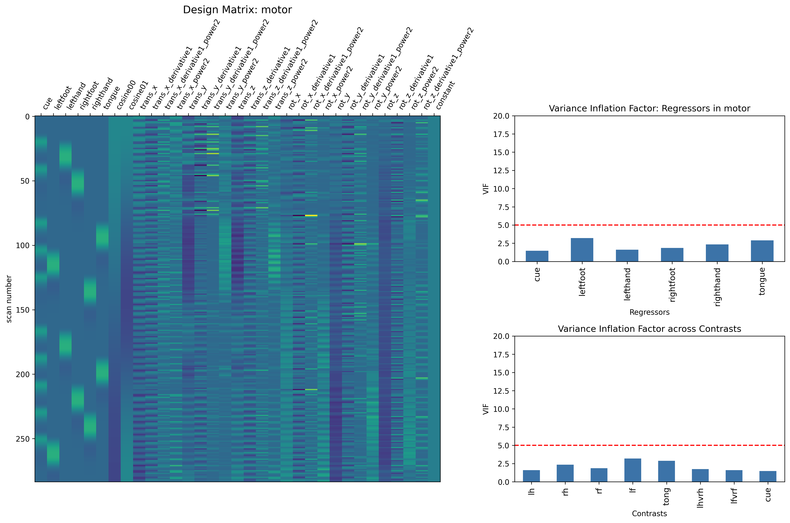

#### Alt Model

  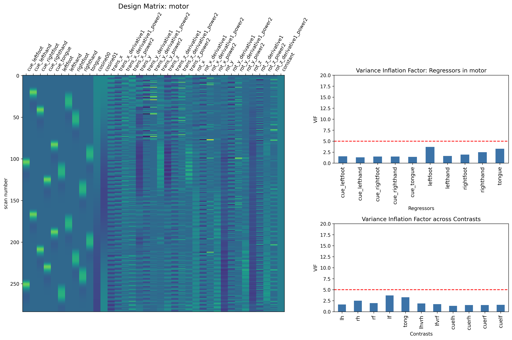

### Gambling

#### HCP Model

  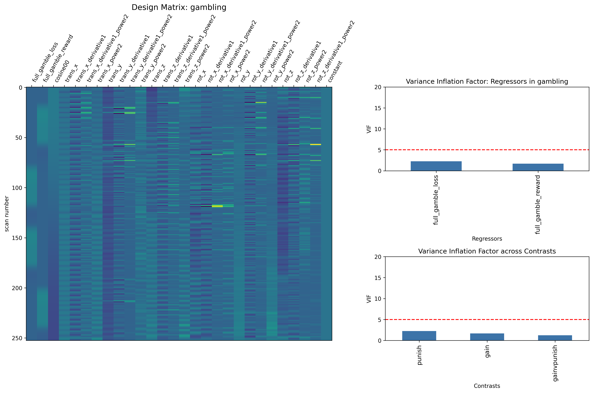

#### Alt Model

  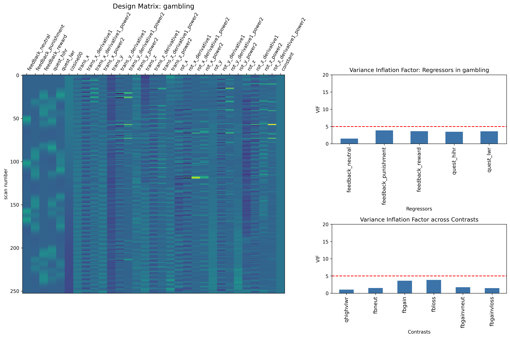

### Emotion

#### HCP Model

  

#### Alt Model

  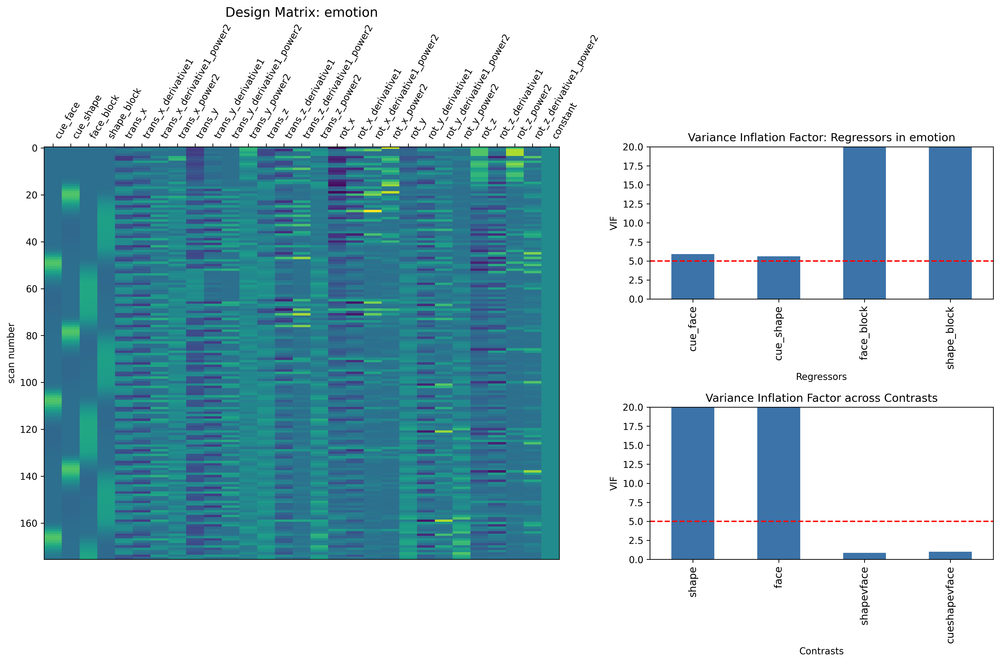

### Social

#### HCP Model

  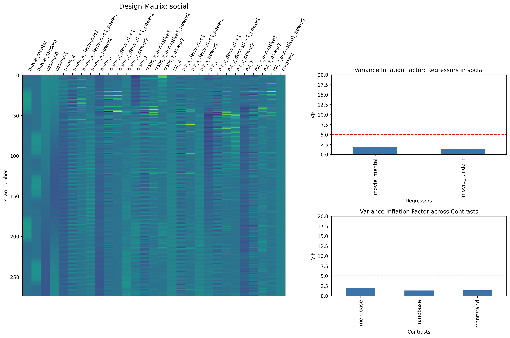

#### Alt Model

  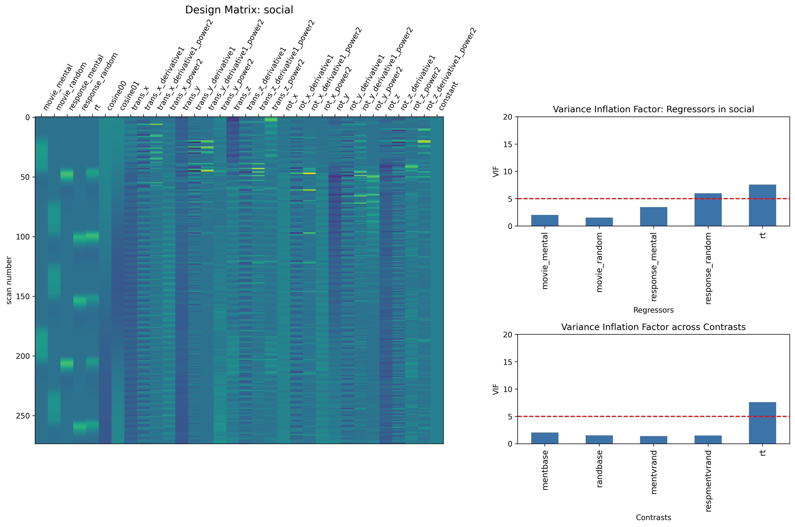

### WM

#### HCP Model

  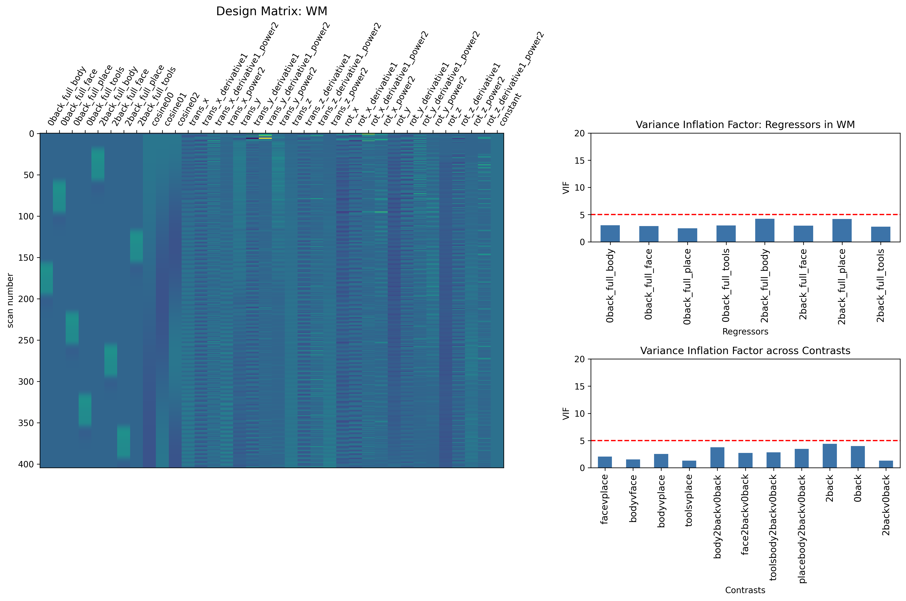

#### Alt Model

  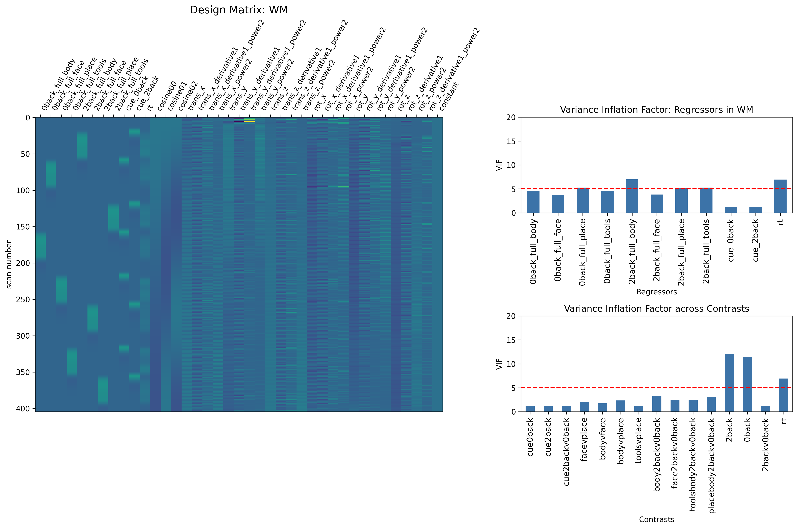

### Relational

#### HCP Model

  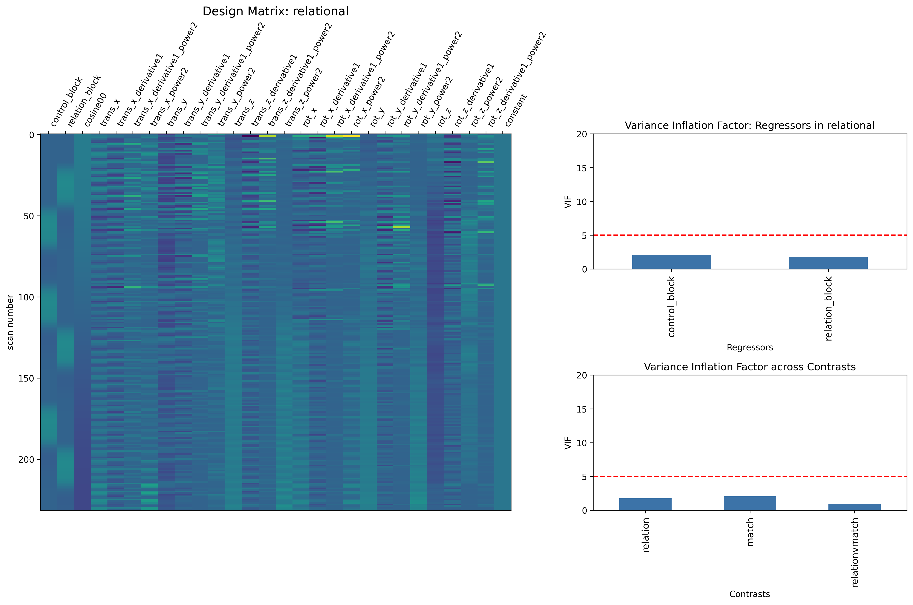

#### Alt Model

  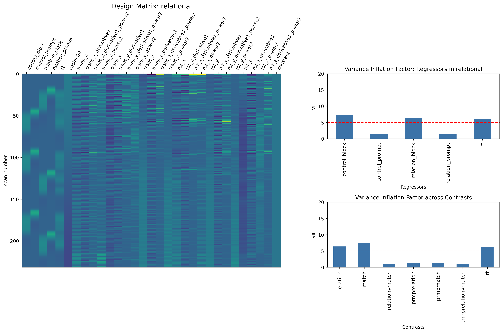

### Language

#### HCP Model

  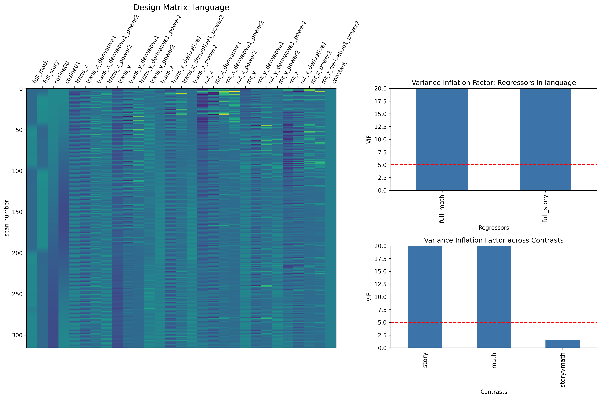

#### Alt Model

  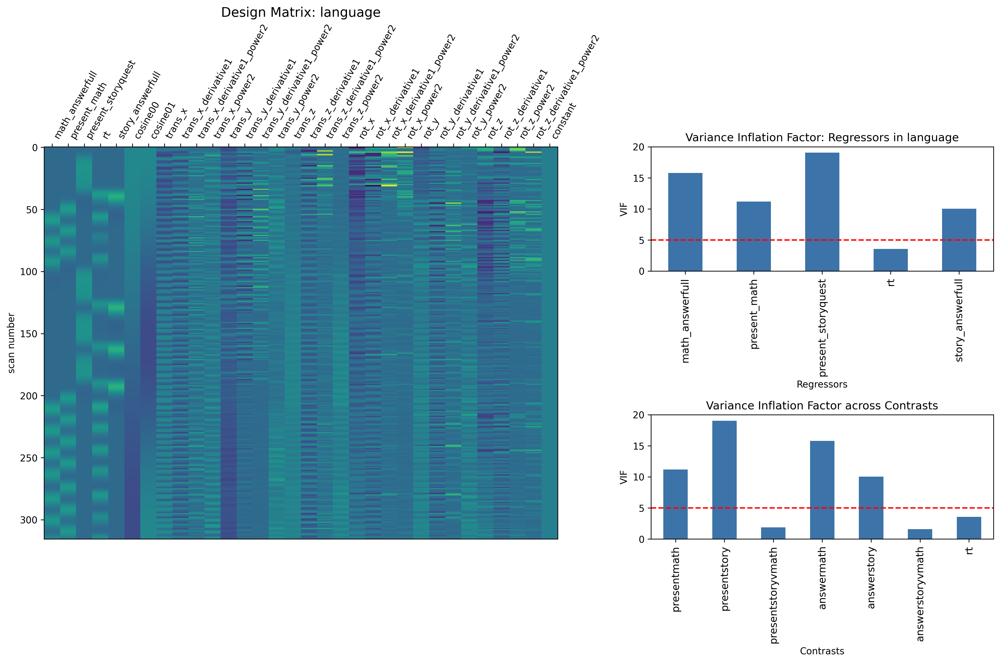

## Subject Completed

The report below includes the Ns for First Level, Fixed Effect and residual variance computed Timeseries for each of the two models. 

### HCP

  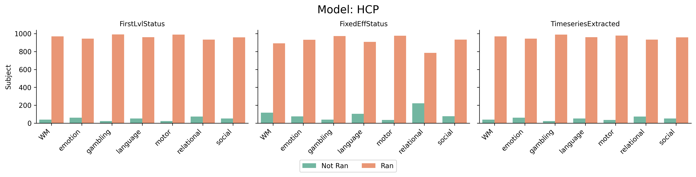

### Alt

The Alt model fits a more complex model, in some instances a subject that is ran using the HCP model may have an issue in the Alt model fitting procedure. This is generally N < 5 for a given task. The First Level  Status will have a higher N than Fixed Effect Status. This is due to the fact that if a subject has a) less than 2 runs and/or b) poor brain coverage with an MNI template, the model is not computed. The same is true for the [residual]  Timeseries Extraction. 

  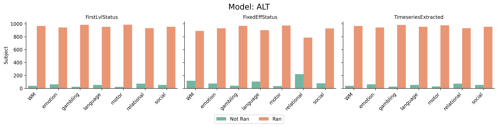

## Data on S3 Bucket Completed

This report covers the number of unique subjects files sync'd to the HCP AWS S3 bucket. 

### HCP

The first figure summarizes the unique subject counts on s3 for subject folders for each model type.

  

The second figure summarizes the unique file counts per subject for each task and run on s3.

  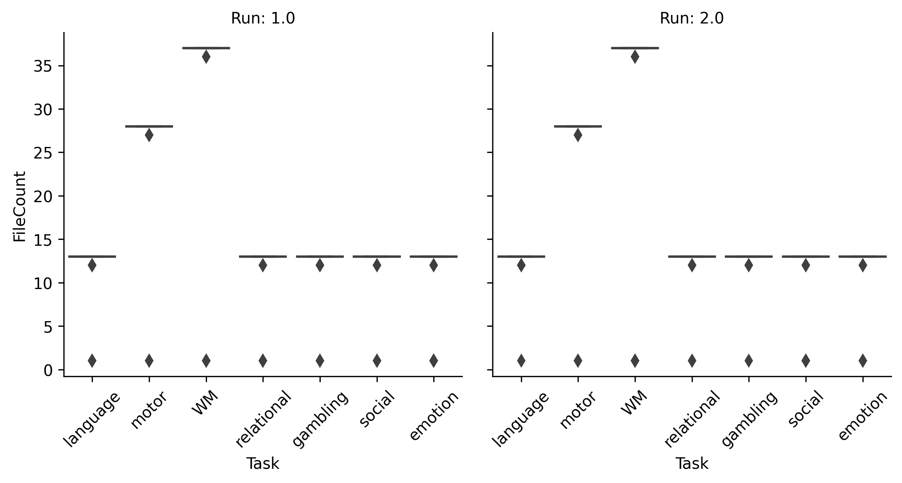

### Alt

The first figure summarizes the unique subject counts on s3 for subject folders for each model type.

  

The second figure summarizes the unique file counts per subject for each task and run on s3.

  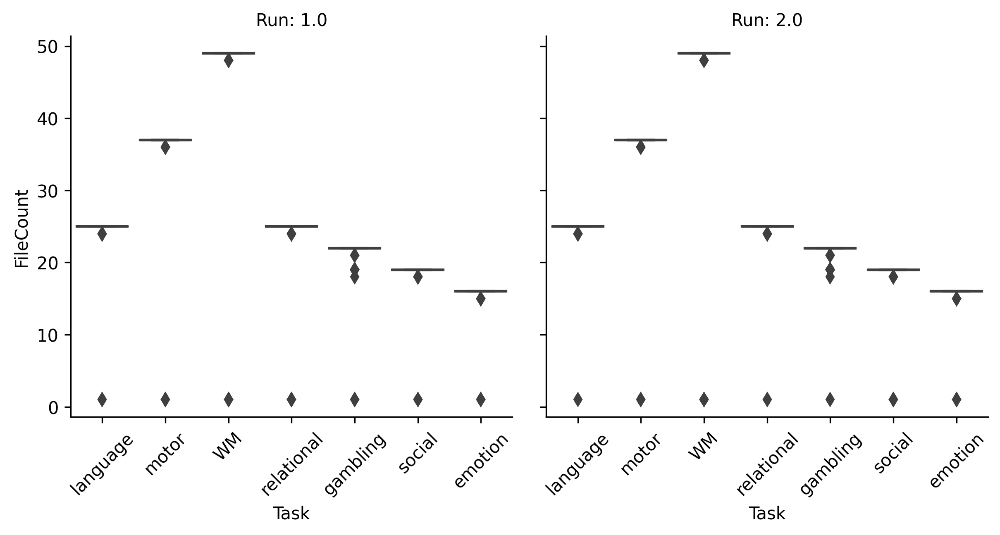

