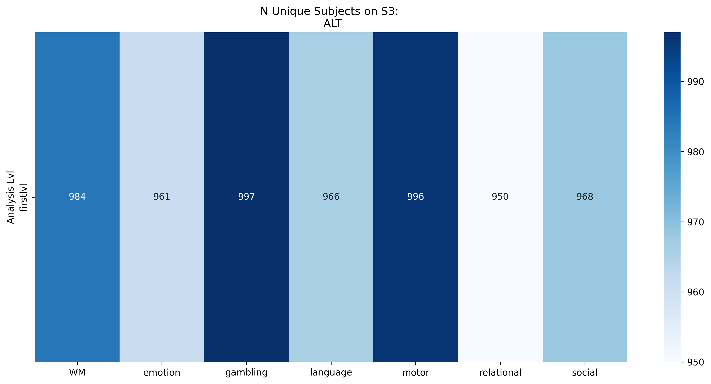

# HCP-YA Task BOLD Modeling

## Summary of Task Modeling Decisions

Task GLMs were fit for all seven of the HCP tasks using the [fMRIPrep](../fmriprep/) derived MNI152 BOLD and the computed [behavioral events](../taskevents/) files. The summaries below include the model examples and counts of subjects ran for the first and second level models.

General information about subject-level models: Within-run and within-subject models were estimated using Nilearn 0.10.4 [Abraham et al., 2014] in Python 3.9.7. FirstLevel models were computed only if subject-level run data had sufficient brain coverage. To ensure sufficient BOLD coverage in MNI space, a Dice coefficient was calculated to assess the overlap between the binarized `MNI152NLin2009cAsym_res-02` brain template and the subject-specific brain mask derived from the BOLD data. The subject's brain mask was retrieved from the fMRIPrep'd preprocessed data. The Dice coefficient between this brain mask and the reference brain mask (from the standard MNI space) was computed using the image_similarity function in `PyReliMRI`. If coverage was < 70% between the two masks, the first level computation was skipped. This ensured that only valid runs with accurate brain masks were included in the first-level GLM fitting.

For each of the two runs with >70% Dice coefficient, a within-run model was fit using Nilearn's `FirstLevelModel` applied to the subject-specific fMRI time series data. The design matrix included task regressors defined by the `HCP` and `ALT` models, as well as nuisance regressors: cosine basis functions from fMRIPrep corresponding to a 128s highpass filter, and 12 motion-related parameters (three translations, three rotations, and their temporal derivatives). Time series data were pre-whitened using an AR(1) model and spatially smoothed with a 5 mm FWHM Gaussian kernel. For each run and contrast of interest (see [contrast json](./input_taskmodel.json)), Nilearn's `compute_contrast` function was used to derive the contrast estimate (effect size), its associated variance (effect variance) and z-scored statistical maps. Additionally, r-squared and residual variance maps were computed and saved for each run. The residual maps were used to extract correlation matrices from the time series data (described below).

After both runs were processed, fixed effects were computed at the subject level using Nilearn's `compute_fixed_effects` function. This was performed *only* when 1) there were two runs of data and 2) both runs had sufficient brain coverage (as determined by the mask overlap threshold). Fixed effects were computed without enabling the precision_weighted option, resulting in an unweighted average of the run-level contrast estimates.

Parcel-specific timeseries data were extracted from the residual timeseries for both models. First, the residual 4D volumes were saved for each of the two runs across all tasks for the HCP and ALT models. To restrict analyses to voxels with 1) sufficient signal and 2) anatomical plausibility, a subject-specific brain mask was computed by combining functional and anatomical criteria. First, a voxel-wise variance map was generated from the preprocessed BOLD data and binarized to include only non-zero voxels. This reflects regions with temporal variability, as variance for zero values and non-signal voxels would be zero. This was intersected with a binarized probabilistic gray matter segmentation image from the subject's anatomical data (thresholded at >1%). The resulting mask—representing the intersection of non-zero functional variance and gray matter probability—was used to constrain subsequent time series extraction and GLM estimation to relevant brain regions using `NiftiLabelsMasker` for the Schaefer 1000 deterministic atlas and `NiftiMapsMasker` for the Dimuo 1024 probabilistic atlas.

# Task Models

## Overview

Two separate models were fit to the subject-level timeseries data: `HCP` and `Alternative`. HCP models are the block-level models described in [Barch et al. 2013](https://www.sciencedirect.com/science/article/pii/S1053811913005272) for each of the seven tasks. In some cases, the HCP and Alternative models are comparable except for minor differences (e.g., in the motor task), while in others, such as the Gambling and Language tasks, they vary more meaningfully.

The variability between the models stems from two primary factors:
1. The Alternative models include response time regressors when they are sensible to include
2. The Alternative models represent stimuli and blocks differently to ensure we're modeling the construct of interest occurring at the times of the individual trials/stimuli and capturing the variability of trials (larger N) rather than blocks (lower N)

The figures below include:
1. The Design Matrix with all modeled regressors 
2. The estimated variance inflation factor (VIF) for the regressors of interest
3. The contrasts of interest, in a single subject

## Motor Task

### HCP Model


### Alternative Model


## Gambling Task

### HCP Model


### Alternative Model


## Emotion Task

### HCP Model


### Alternative Model


## Social Task

### HCP Model


### Alternative Model


## Working Memory (WM) Task

### HCP Model


### Alternative Model


## Relational Task

### HCP Model


### Alternative Model


## Language Task

### HCP Model


### Alternative Model


# fMRI Processing Status Report

## Subject Completion Status

This report summarizes the Ns for First Level, Fixed Effect, and residual variance computed Timeseries for each of the two models.

### HCP Model


### Alternative Model

The Alternative model fits a more complex model. In some instances, a subject that is processed using the HCP model may encounter issues in the Alternative model fitting procedure. This generally affects fewer than 5 subjects for a given task.

The First Level Status shows higher N than Fixed Effect Status. This occurs because subjects with (a) fewer than 2 runs and/or (b) poor brain coverage with an MNI template are excluded from model computation. The same criteria apply for the Timeseries Extraction.


## Data on S3 Bucket Status

This section details the number of unique subject files synchronized to the HCP AWS S3 bucket.

### HCP Model

The figure below summarizes the unique subject counts on S3 for subject folders for each model type:


The following figure shows the unique file counts per subject for each task and run on S3:


### Alternative Model

The figure below summarizes the unique subject counts on S3 for subject folders for each model type:



The following figure shows the unique file counts per subject for each task and run on S3:


## Key Components

### Scripts
- **`make_glmjob.sh`** - Interactive job generator that creates SLURM batch files
- **`template.glms`** - Template for individual subject processing jobs
- **`submit_glmjobs.sh`** - SLURM batch script for parallel execution
- **`run_subjectmodels.py`** - Main Python pipeline for GLM analysis

### Configuration
- **`input_taskmodel.json`** - Task specifications, model parameters, and contrast definitions
- **`prep_eventsdata.py`** - Event file preprocessing for different task types


### Usage

1. **Generate Jobs**: Run `make_glmjob.sh` and select session type (3T)
2. **Submit to Cluster**: Execute `submit_glmjobs.sh` via SLURM
3. **Monitor Progress**: Check logs in `logs/` directory

### Outputs

- **First-level GLMs** - Individual run statistical maps
- **Fixed-effects** - Combined across-run statistics  
- **VIF estimates** - Design matrix collinearity metrics
- **Timeseries** - ROI-based signal extraction
- **S3 Upload** - Automated cloud storage sync

### Configuration Loading and Task Processing Flow

#### JSON Configuration Structure

The `input_taskmodel.json` defines a hierarchical structure for each task:

```json
"taskname": {
    "runs": ["1", "2"],
    "fwhm": "5.0",           // Smoothing kernel
    "noise_mod": "ar1",      // Autocorrelation model
    "boldtr": ".720",        // Repetition time
    "num_volumes": "405",    // Expected BOLD volumes
    "model_type": {          // Either "hcp" or "alt"
        "trialtype_filter": [...],    // Event types to include
        "nuisance_regressors": "...", // Confound regressors
        "contrasts": {...}            // Statistical contrasts
    }
}
```

#### Dynamic Event Processing Pipeline

The main script processes each task using this workflow:

```python

config = study_details[task]
mod_config = config[mod_spec]  # Get model-specific settings

if task == 'motor':
    events_dat = prep_motor_events(**common_params)
elif task == 'gambling':
    events_dat = prep_gamble_events(**common_params, new_trialcol_name='new_trialtype')
```

#### Event Data Transformation Examples

**Working Memory Task (WM)**

*HCP Model*:
- Filters: `["2back_full", "0back_full"]`
- Combines cue + block timing for continuous regressors
- Creates stimulus-specific trial types: `2back_full_face`, `0back_full_tools`

*Alt Model*:
- Filters: `["cue_2back", "cue_0back", "2back_full", "0back_full"]` 
- Adds reaction time regressors from response trials
- Separates cue and task periods

**Social Task**
*HCP Model*:

```python
#  combined trial types from two columns
events_dat = comb_names(
    eventsdf=eventdf_cpy, 
    fst_colname='trial_type',     # "movie"
    scnd_colname='social_type',   # "mental"/"random"
    new_colname='new_trialtype'   # Result: "movie_mental", "movie_random"
)
```

*Alt Model*:
```python
# Adds reaction time modeling
events_dat = add_reactiontime_regressor(
    eventdf_cpy, 
    trial_type_col='trial_type', 
    resp_trialtype='response',
    response_colname='response_time',
    rtreg_name='rt'
)
```

#### Design Matrix Construction

The processed events are feed into design matrix creation:

```python
design_matrix = create_design_matrix(
    eventdf=events_dat,
    conf_path=conf_path,
    conflist_filt=mod_config['nuisance_regressors'],  # From JSON
    volumes=bold_volumes,
    time_rep=float(config['boldtr']),                 # From JSON
    hrf_type=config['hrf_type'],                      # From JSON
    trialtype_colname='new_trialtype' if task in ['gambling', 'social', 'WM'] else 'trial_type'
)
```

#### Contrast Computation

Contrasts are defined in JSON and computed automatically:

```json
"contrasts": {
    "2backv0back": "0.25 * `2back_full_body` + 0.25 * `2back_full_face` + ... - 0.25 * `0back_full_body` - ...",
    "facevplace": "0.5 * `2back_full_face` + 0.5 * `0back_full_face` - 0.5 * `2back_full_place` - ..."
}
```

#### Quality Control Integration

The pipeline validates against JSON specifications:

```python
# volume counts
bold_volumes = get_numvolumes(nifti_path_4d=bold_path)
if bold_volumes != n_vols:  # n_vols from JSON
    print(f"Warning: Mismatch in expected ({n_vols}) vs actual BOLD volumes")

# brain mask coverage check
dice_coeff = image_similarity(imgfile1=brain_mni_mask, imgfile2=mask_fullpath)
if dice_coeff > .70:  # Proceed with analysis
```

#### Task-Specific Event Handling

Each `prep_*_events()` function handles unique aspects:

- **Gambling**: Reward/loss outcome mapping
- **Motor**: Cue consolidation across movement types  
- **Emotion**: Cue + block timing combination
- **Language**: Response time extraction from multiple trial types
- **Relational**: Stimulus-response pairing

This design allows the same pipeline to handle the range of cognitive paradigms while maintaining consistent statistical modeling decisions.