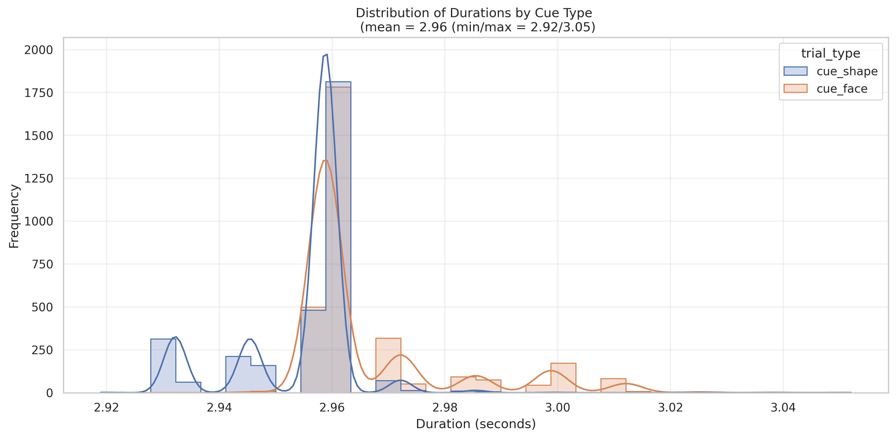
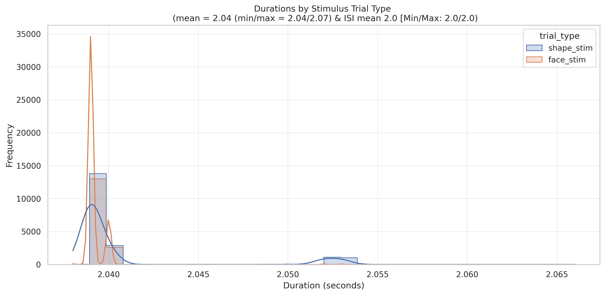
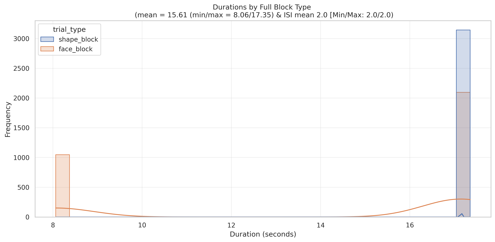
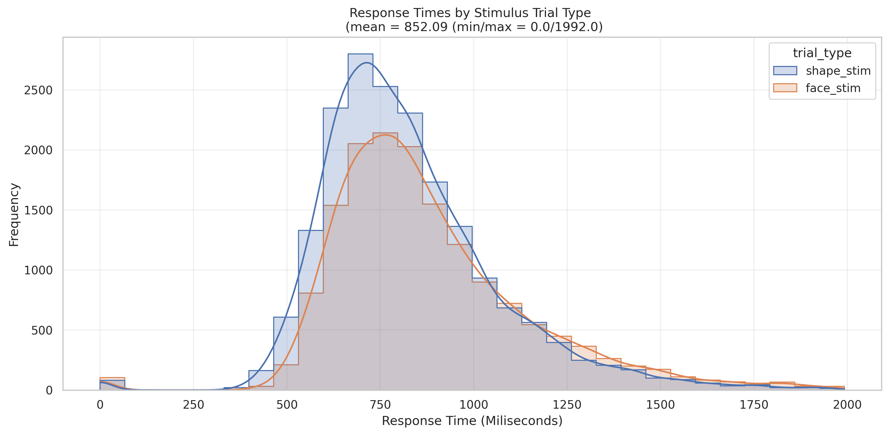
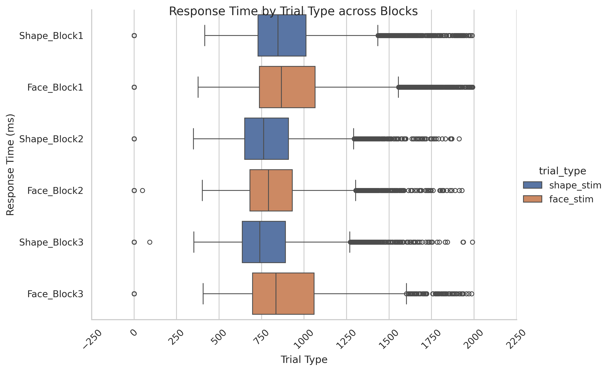

# Emotion Affecting Task

## Summary of Task

The [Barch et al. (2013, pg 178-179)](https://www.sciencedirect.com/science/article/pii/S1053811913005272) highlights the Emotion Task as:

"Emotion processing. This task was adapted from the one developed by Hariri and colleagues which had shown evidence as a functional localizer (Hariri et al., 2002) with moderate reliability across time  Group Analysis Task Activation Maps Percentage of Individual Participants Showing  Activation at Z > 1.96  Incentive Processing (Gambling Task)  Reward vs. Baseline Reward vs. Baseline  X = 14 Y= 6 Z= 0 X = 14 Y= 6 Z= 0  Reward vs. Punishment Reward vs. Punishment  X = 14 Y= 6 Z= 0 X = 14 Y= 6 Z= 0  L  R  RL  L  R  RL  L  R  RL  L  R  RL  75%  75%  50%  -5  5  ± 2.32  75%  75%  50%  -5  5  ± 2.32  Fig. 6. Group and activation count maps for the incentive processing task. (Manuck et al., 2007). The participants are presented with blocks of trials that ask them to decide either which of two faces presented on the bottom of the screen match the face at the top of the screen, or which of two shapes presented at the bottom of the screen match the shape at the top of the screen. The faces have either angry or fearful expressions. *Trials are presented in blocks of 6 trials of the same task (face or shape), with the stimulus presented for 2 s and a 1 s ITI. Each block is preceded by a 3 s task cue (“shape” or “face”), so that each block is 21 s including the cue.* Each of the two runs includes *3 face blocks and 3 shape blocks*. However, there was a **bug in the E-prime script for this task such that the task stopped short of the last three trials of the last task block in each run**. To promote comparability across the participants, we decided not to fix the bug (given that a number of subjects had already been run before it was detected) as we thought it would have minimal impact on the data. In phase I, we compared this task to one using negative and neutral IAPS pictures (see the Supplemental materials)."

## Basic Trial Structure

The task includes "Face and "Shape" blocks. The tasks starts with the the presentation of whether a Shape or Face block (avg durations 2.9 [min/max, 2.9/3.1]). After the Cue, the stimuli appear. After the stimulus, there is a brief fixation before the consecutive stimulus. stimuli are consecutive after the fixation before the change in block, whereby a new Cue starts.

The below distributions are from Run 1 across **all available subjects and trials**.

### Distributions of Durations

First, the distribution of Cue across conditions.

  

Second, the distribution of the stimulus durations (M: 2.04, Min: 2.04, Max: 2.07) with the constant ISI (2sec)

  

Third, the distribution of the full block durations. Note, the bin near the 8 seconds reflects the E-prime error which corresponds with the final *face* block which is cut off.

  

### Distribution of Response Times

First, the distribution of response time across stimulus type (Face/Shape).

  

Second, the histogram of response time across stimulus type (Face/Shape). The responses for shape are slightly faster than shape.

  

Third, the histogram of response time across stimulus type (Face/Shape) and blocks (1-3). 

  

### First / Last Onset and Duration

## Emotion Task E-Prime Column Details
### Labels
- **Procedure:** InitialTR, ShapePromptPROC, FacePromptPROC, TrialsPROC
- **OverallAcc:** Running accuracy (0-100)

### Timings
- **SyncSlide.OnsetTime:** Initial TR 
- **StimSlide.OnsetTime:** Start of stimulus 
- **shape.OnsetTime:** Start of the shape block
- **face.OnsetTime:** start of face block
- **StimSlide.OnsetTime:** start of stimulus slide
- **StimSlide.RT:** Stimulus response time
- **StimSlide.FinishTime:** Finish time of stimulus
- **StimSlide.OnsetToOnsetTime:** duration of the stimulus slide
- **StimSlide.ACC:** stimulus accuracy