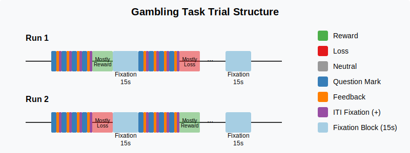
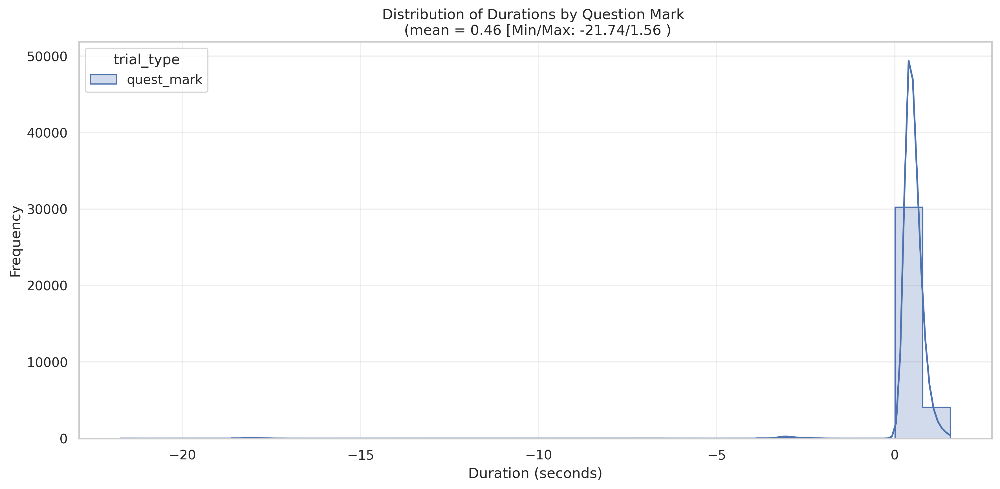
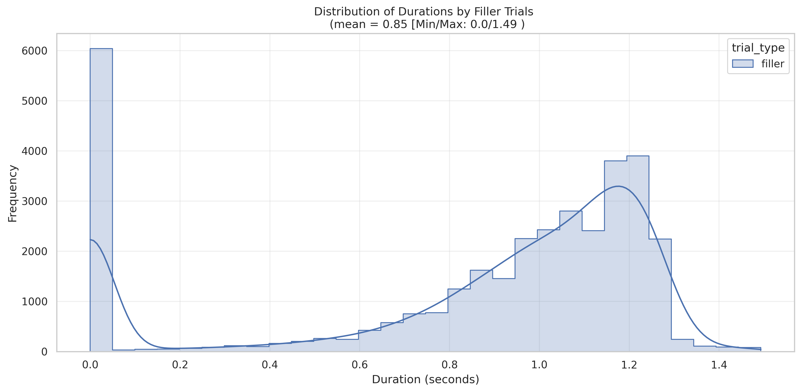
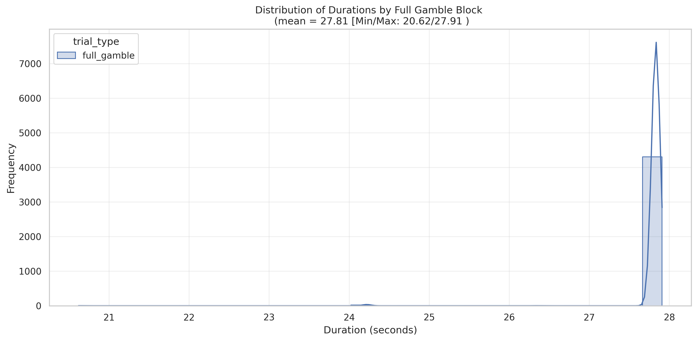
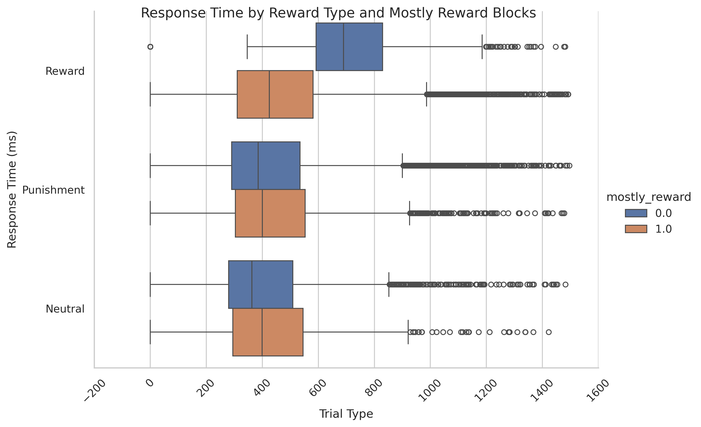

# Gambling [Delgato] Reward Task

## Summary of Task

The [Barch et al. (2013, pg 177)](https://www.sciencedirect.com/science/article/pii/S1053811913005272) highlights the Gambling Task as:

"Incentive processing. This task was adapted from the one developed by Delgado et al. (2000), and was chosen based on prior evidence that the task elicits activations in the striatum and other reward related regions that are robust and reliable across the subjects (Delgado et al., 2000; Forbes et al., 2009; May et al., 2004; Tricomi et al., 2004). The participants play a card guessing game where they are asked to guess the number on a mystery card (represented by a “?”) in order to win or lose money. They are told that potential card numbers range from 1 to 9 and to indicate if they think the mystery card number is more or less than 5 by pressing one of two buttons on the  response box. Feedback is the number on the card (generated by the program as a function of whether the trial was a reward, loss or neutral trial) and either: 1) a green up arrow with `$1` for reward trials, 2) a red down arrow next to − `$0.50` for loss trials; or 3) the number 5 and a gray double headed arrow for neutral trials. The “?” is presented for up to 1.5 s (if the participant responds before 1.5 s, a fixation cross is displayed for the remaining time), following by feedback for 1.0 s. There is a 1.0 s ITI with a “+” presented on the screen. The task is presented in blocks of 8 trials that are either mostly reward (6 reward trials pseudo randomly interleaved with either 1 neutral and 1 loss trial, 2 neutral trials, or 2 loss trials) or mostly loss (6 loss trials interleaved with either 1 neutral and 1 reward trial, 2 neutral trials, or 2 reward trials). In each of the two runs, there are 2 mostly reward and 2 mostly loss blocks, interleaved with 4 fixation blocks (15 s each). All the participants are provided with money as a result of completing the task, though it is a standard amount across subjects."

## Basic Trial Structure

The task includes Reward, Punishment and Neutral Trials. The tasks starts presentation of a "?". During this window, the participant decides whether the number if above or below "5". If they response quickly, there is a filler window, otherwise it proceeds to the feedback. During feedback, there participant whether they won (green up arrow), low (red down arrow) or nothing was at stake. Before the next trial, there is a 1sec fixation. For each gamble block, there are consecutive trial, between which there is a fiften second fixation block.

See diagram below.

  

The below distributions are from Run 1 across **all available subjects and trials**.

### Distributions of Durations

First, the distribution of Question Mark.

  

Second, the distribution of the Filler

  

Third, the distribution of the full gamble block durations.

  

### Distribution of Response Times

Below are the distirbutions of response times across type (Reward / Punishment) and whether Mostly Reward or Mostly Loss blocks.

  

## Gambling Task
### Labels
- **Running[Block]:** ReadyList, SessionSelectionList
- **Procedure[Trial]:** Blank (Initial TR), GamblingTrialPROC (trials), FixationBlockPROC (fixation)
- **TrialType:** Reward, Punishment, Neutral
- **FeedbackNumber:** 1-9

### Timings
- **GetReady.OnsetTime:** 
- **SyncSlide.OnsetTime:** Initial TRs (4) 
- **QuestionMark.OnsetTime:**  Onset of question  mark.
- **QuestionMark.OnsetToOnsetTime:** Duration of question mark if no filler (typically 0)
- **QuestionMark.RT:** Response time
- **FillerFixation.OnsetTime:** Onset time of filler (sometimes 0 when RT is slow)
- **FillerFixation.OnsetToOnsetTime:** duration of filler when filler exists (otherwise 0)
- **Feedback.OnsetTime:** Feedback onset time
- **Feedback.OnsetToOnsetTime:** Duration of feedback, sometimes zero
- **OneSecFixation.OnsetTime:** ITI fixatio
- **FifteenSecFixation.OnsetTime:** Fixation Block onset 
