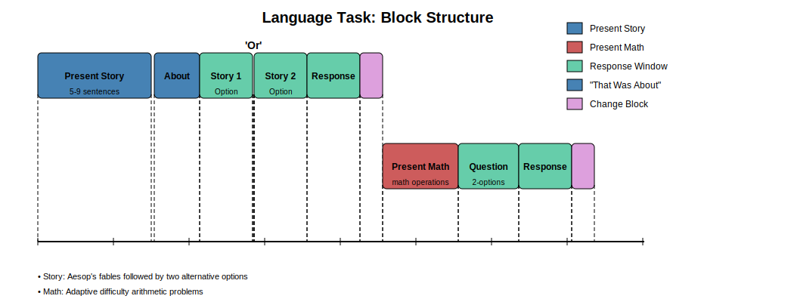

# Language Task

## Summary of Task

The [Barch et al. (2013, pg 177-178)](https://www.sciencedirect.com/science/article/pii/S1053811913005272) highlights the Language Task as:

"Language processing. The task being used in Phase II was developed by Binder et al. (2011) and used the E-prime scripts kindly provided by these investigators, which were then modified for our purposes. The task consists of two runs that each interleave 4 blocks of a story task and 4 blocks of a math task. As described in detail in Binder et. al. (2011), the goal of including the math blocks was to provide a comparison task that was attentionally demanding, similar in auditory and phonological input, and unlikely to generate activation of anterior temporal lobe regions involved in semantic processing, though likely to engage numerosity related processing in the parietal cortex. The lengths of the blocks vary (average of approximately 30 s), but the task was designed so that the math task blocks match the length of the story task blocks, with some additional math trials at the end of the task to complete the 3.8 min run as needed. The story blocks present participants with brief auditory stories (5–9 sentences) adapted from Aesop's fables, followed by a 2-alternative forcedchoice question that asks the participants about the topic of the story. The example provided in the original Binder paper (p. 1466) is “For example, after a story about an eagle that saves a man who had done him a favor, participants were asked, ‘That was about revenge or reciprocity?’” The math task also presents trials auditorily and requires the subjects to complete addition and subtraction problems. The trials present the subjects with a series of arithmetic operations (e.g., “Fourteen plus twelve”), followed by “equals” and then two choices (e.g., “twenty-nine or twenty-six”). The participants push a button to select either the first or the second answer. The math task is adaptive to maintain a similar level of difficulty across the participants. For more details on the task, see Binder et al. (2011)."

*Note, between Story Option 1 and Story Option 2 presentations there is a brief, audible "or" for the Story block.*

## Basic Trial Structure
Each block begins with either a Story or Math trial presentation. After the presentation, a corresponding question is shown for the respective trial type. This is followed by a response/answer window. Typically, a Change block follows each trial block. For Math trials, consecutive Math blocks often occur. See the diagram below.

  

The below distributions are from Run 1 across **all available subjects and trials**.

### Distributions of Durations

First, the distribution of Duration times for Story and Math Presentations.

  

Second, full block durations for Story and Math.

  

Third, the distribution of durations from onset of Story/Math to beginning of Answer.

  

Fourth, the distribution of presentation to question durations for Story and Math.

  

Fifth, the distribution of durations for the change block.

  

### Distribution of Response Times

First, the distirbutions of response times across trial type.

  

Second, the distirbutions of response times math difficulty.

  

Third, the accuracy across math difficulties

Fisrt, the distirbutions of response times across trial type.

  

## Language Task
### Labels
- **TaskName:** 'Story', 'Math', blank
- **Procedure[Block] Includes:**
  - "StoryProc" → Story
  - "MathProc" → Math
  - "PresentChangeProc" → When block changes from story to math, vice versa
  - "DummyProc" → Extra
- **TaskList.Sample / TaskList.Cycle / Running[Block]:** Trial array, task-related (2, 1-N, TaskList) or not (blank, blank, FinalLoop)
- **Procedure[Trial]:** 'StoryTrialProc', 'PresentMath', Blank
- **CurrentMathLevel[Trial]:** Range of math level (difficulty?)
- **CurrentStory[Trial]**

### Timings
- **GetReady.OffSetTime:** Scanner offset, starting task  
- **Story:**
  - **PresentStoryFile.OnsetTime:** Story file start 
  - **PresentStoryFile.FinishTime:** End time  
  - **Wait500.OnsetTime[Trial]:** Window between story and question, 500ms break  
  - **Wait500.FinishTime[Trial]:**  
  - **ThatWasAbout.OnsetTime:** Question for story  
  - **ThatWasAbout.FinishTime:** Question offset 
  - **PresentStoryOption1.OnsetTime:** Response  
  - **PresentStoryOption1.FinishTime:** Response 
  - **PresentStoryOption1.RTTime:** Response time  
  - **PresentStoryOption1.RT:** Response time (ms)  
  - **PresentStoryOption1.RESP:** Button press (2/3, index/middle?)
  - **OrAudio.OnsetTime:** Audio label  of "Or" audio presentation between story options
  - **OrAudio.FinishTime:** Audio end  of "Or" audio presentation between story options
  - **OrAudio.RTTime:**  
  - **OrAudio.RT:**   
  - **PresentStoryOption2.OnsetTime:** Response  
  - **PresentStoryOption2.FinishTime:** Response  
  - **PresentStoryOption2.RTTime:** Response time  
  - **PresentStoryOption2.RT:** Response time (ms)  
  - **PresentStoryOption2.RESP:** Button press (2/3, index/middle?)
  - **ResponsePeriod.OnsetTime:**  
  - **ResponsePeriod.FinishTime:** 
  - **ResponsePeriod.RTTime:**  
  - **ResponsePeriod.RT:**  
  - **ResponsePeriod.RESP:**
  - **ResponsePeriod.ACC:** 0/1 (0 corr, 1 incorr)
  - **FilteredTrialStats.RTTIME:** Same as ResponsePeriod.RTTime  
  - **FilteredTrialStats.RTFromFirstOption:**  
- **Change block:**
  - **ExperimenterWindow.OnsetTime[Block]:** Block change start  
  - **PresentBlockChange.OnsetTime:**  
  - **PresentBlockChange.FinishTime:** 
  - **Wait500.OnsetTime[Block]:**  
  - **Wait500.FinishTime[Block]:**  
- **Math:**
  - **PresentMathFile.OnsetTime:** Start Math Problem  
  - **PresentMathFile.FinishTime:** 
  - **PresentMathOptions.OnsetTime:** 
  - **PresentMathOptions.FinishTime:**  
  - **PresentMathOptions.RTTime:**  
  - **PresentMathOptions.RT:**  
  - **PresentMathOptions.RESP:**

### Response Info
- **CurrentMathLevel[Trial]:** Difficulty / type
- **FilteredTrialStats.ACC:** 1 correct, 0 incorrect
- **FilteredTrialStats.RESP:** 2/3
- **OverallAcc[Trial]:** Accuracy across trials
- **CorrectResponse:** Correct response expected
- **Option1:**
- **Option2:**