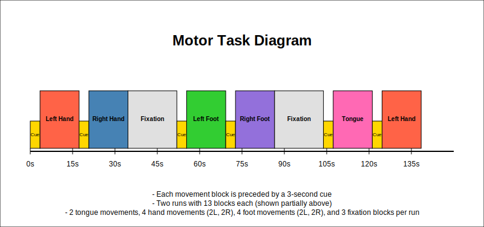
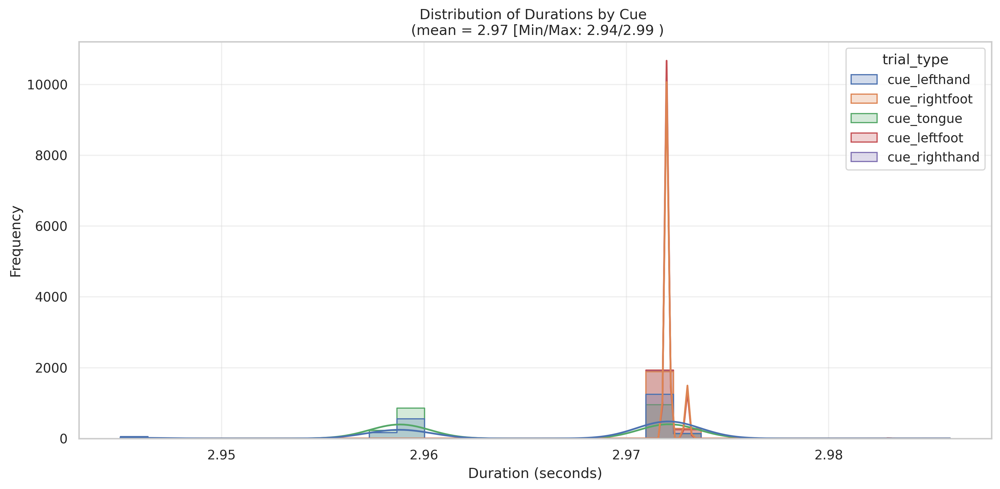
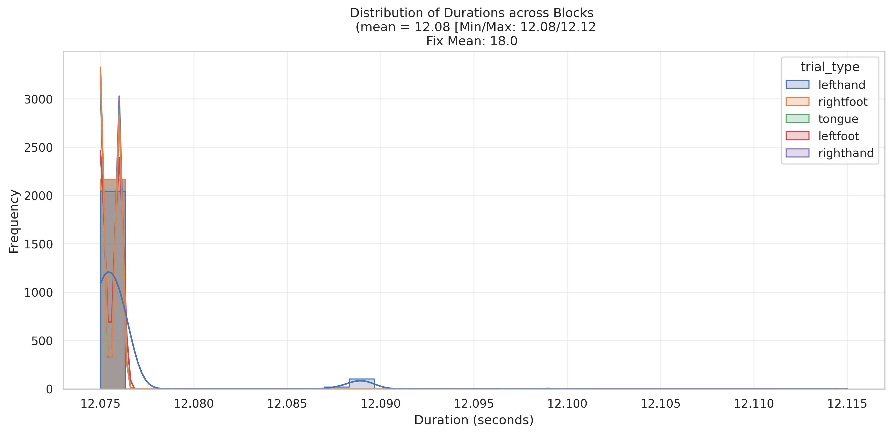

# Motor  Task

## Summary of Task

The [Barch et al. (2013, pg 177-178)](https://www.sciencedirect.com/science/article/pii/S1053811913005272) highlights the Language Task as:

"Motor. This task was adapted from the one developed by Buckner and colleagues which had evidence that it could identify effector specific activations in individual subjects (Buckner et al., 2011; Yeo et al., 2011). The participants are presented with visual cues that ask them to tap their left or right fingers, squeeze their left or right toes, or move their tongue to map motor areas. Each block of a movement type lasts 12 s (10 movements), and is preceded by a 3 s cue. In each of the two runs, there are 13 blocks, with 2 of tongue movements, 4 of hand movements (2 right and 2 left), 4 of foot movements (2 right and 2 left) and three 15 s fixation blocks per run."

## Basic Trial Structure

The task includes five **cue types**:  
- Left Hand
- Right Hand  
- Left Foot  
- Right Foot  
- Tongue movement

*Cue Presentation*. Each movement block begins with a cue indicating the type of movement.
*Movement Period*. A 12-second movement period follows the cue presentation, during which the participant performs the indicated movement.
*Fixation Blocks*. Placed intermittently between cue-movement blocks.

  

The below distributions are from Run 1 across **all available subjects and trials**.

### Distributions of Durations

First, the distribution of Cue durations across conditions.

  

Second, the distribution of the movement blocks across conditions.

  

## Motor Task
### Labels
- **Procedure[Block]:** CountDownList or MOTORList.
  - Countdown is the wait period & motor is the task
  - CountDownSlide.OnsetTime: Start of slide (adjust OnsetTime minus CountDownSlide.OnsetDelay for first slide)
- **BlockType:** Left Hand, Right Hand, Left Foot, Right Foot, Tongue, Fixation

### Timing Columns
- **LeftHandCue.OnsetTime:** Start Left Hand Cue
- **RightFootCue.OnsetTime:** Start Right Foot Cue
- **Fixdot.OnsetTime:** Onset time of fixation block
- **TongueCue.OnsetTime:** Onset time of Tongue Cue
- **LeftFootCue.OnsetTime:** Start of Left Foot cue
- **RightHandCue.OnsetTime:** Start of Right Foot Cue