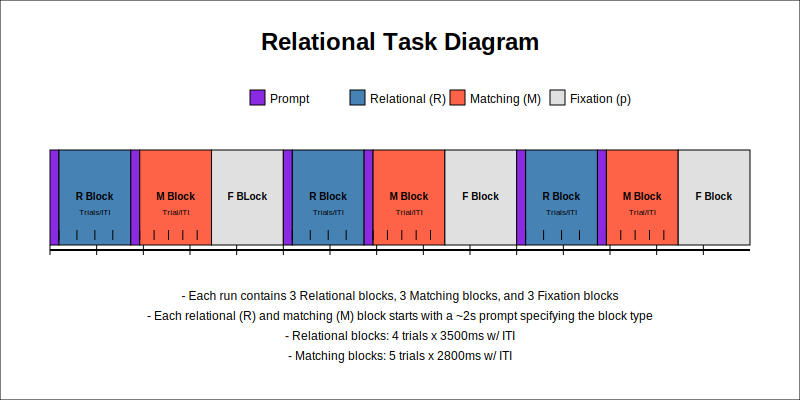
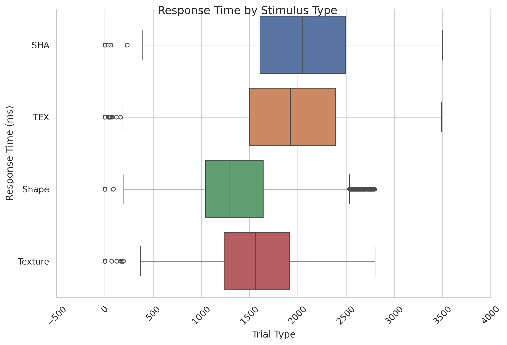

# Relational Task

## Summary of Task

The [Barch et al. (2013, pg 178)](https://www.sciencedirect.com/science/article/pii/S1053811913005272) highlights the Social Task as:

"Relational processing. This task was adapted from the one developed by Smith et al. (2007) which was demonstrated to localize activation in anterior prefrontal cortex in individual subjects. The stimuli are 6 different shapes filled with 1 of 6 different textures. In the relational processing condition, the participants are presented with 2 pairs of objects, with one pair at the top of the screen and the other pair at the bottom of the screen. They are told that they should first decide what dimension differs across the top pair of objects (shape or texture) and then they should decide whether the bottom pair of objects also differs along that same dimension (e.g., if the top pair differs in shape, does the bottom pair also differ in shape). In the control matching condition, the participants are shown two objects at the top of the screen and one object at the bottom of the screen, and a word in the middle of the screen (either “shape” or “texture”). They are told to decide whether the bottom object matches either of the top two objects on that dimension (e.g., if the word is “shape”, is the bottom object the same shape as either of the top two objects). For the relational condition, the stimuli are presented for 3500 ms, with a 500 ms ITI, with four trials per block. In the matching condition, stimuli are presented for 2800 ms, with a 400 ms ITI, with 5 trials per block. Each type of block (relational or matching) lasts a total of 18 s. In each of the two runs of this task, there are 3 relational blocks, 3 matching blocks and three 16 s fixation blocks (see Table 4)."

## Basic Trial Structure

The Relational task begins with a prompt indicating whether it is a Relational or Control condition. Following the prompt, stimulus trials begin and continue consecutively until the next prompt. A fixation block occurs approximately every two blocks. See the diagram below.

  

The distributions below are from Run 1 across **all available subjects and trials.**

### Distributions of Durations

First, the distribution of durations for the prompts

  

Second, the distribution of durations for the full blocks.

  

Third, the distribution of durations for the stimuli. 

  

Fourth, the distribution of durations for the ISI. 

  

Fifth, the distribution of durations for the fixation blocks. 

  

### Distribution of Response Times

The distribution of response time across trial types

  

Second, histogram of response times by stimulus types.

  

Third, distribution of response times by stimulus types and blocks.

  

## Relational Task
### Labels
- **Procedure:** InitialTR, RelationalPromptPROC, RelationalPROC, ControlPromptPROC, ControlPROC, FixationPROC
- **BlockType:** Relational, Control, [BLANK]

### Timings
- **SyncSlide.OnsetTime:** Start of initial TR 
- **RelationalPrompt.OnsetTime:** Onset 
- **RelationalSlide.OnsetTime:** Start of relationship stim 
- **ControlPrompt.OnsetTime:** 
- **ControlSlide.OnsetTime:** 
- **FixationBlock.OnsetTime:** 