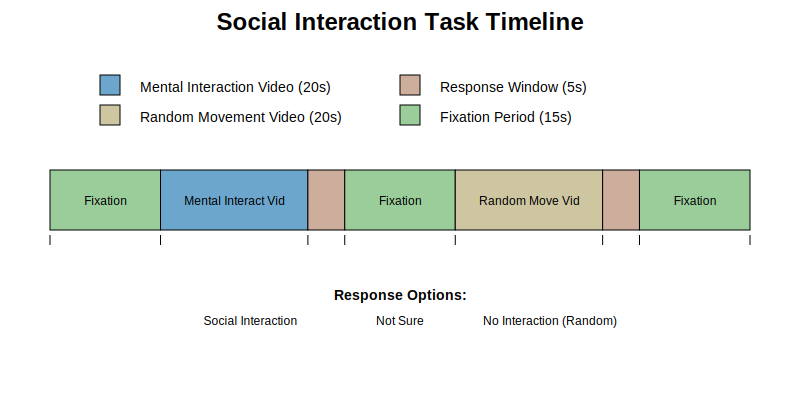
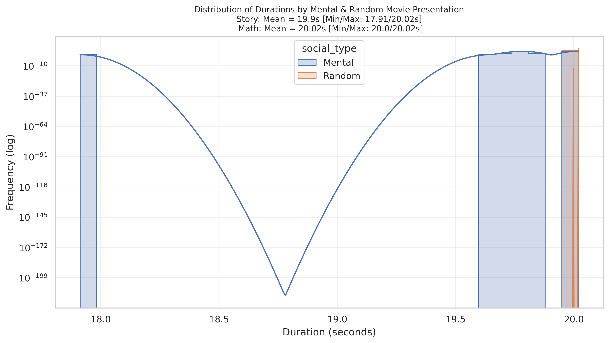
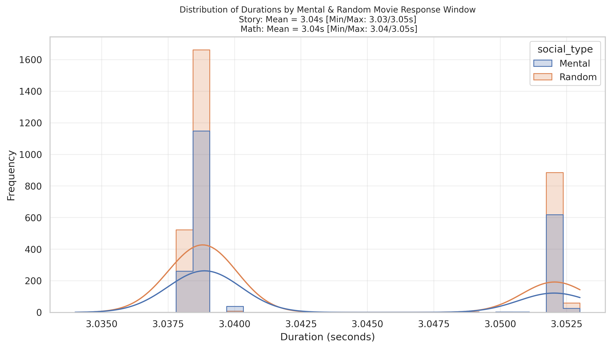
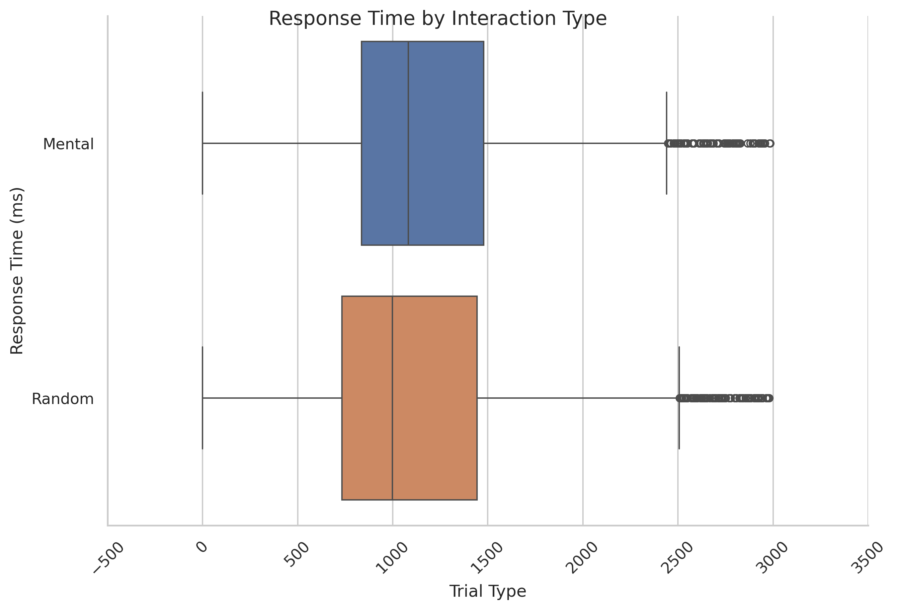
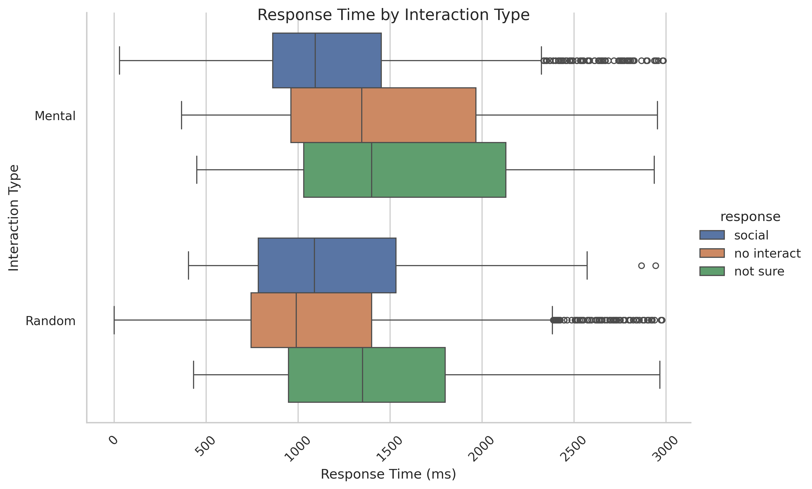
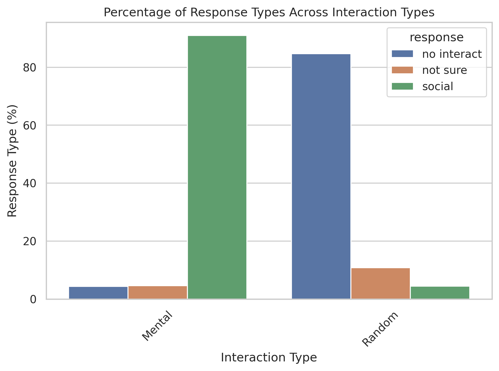

# Social Interaction Task

## Summary of Task

The [Barch et al. (2013, pg 178)](https://www.sciencedirect.com/science/article/pii/S1053811913005272) highlights the Social Task as:

"Social cognition (theory of mind). An engaging and validated video task was chosen as a measure of social cognition, given evidence that it generates robust task related activation in brain regions associated with social cognition and is reliable across subjects (Castelli et al., 2000, 2002; Wheatley et al., 2007; White et al., 2011). The participants are presented with short video clips (20 s) of objects (squares, circles, triangles) either interacting in some way, or moving randomly. These videos were developed by either Castelli et al. (2000) or Wheatley et al. (2007). After each video clip, the participants chose between 3 possibilities: whether the objects had a social interaction (an interaction that appears as if the shapes are taking into account each other's feelings and thoughts), Not Sure, or No interaction (i.e., there is no obvious interaction between the shapes and the  movement appears in random). Each of the two task runs has 5 video blocks (2 Mental and 3 Random in one run, 3 Mental and 2 Random in the other run) and 5 fixation blocks (15 s each). Of note, the video clips were shortened to 20 s (the Castelli et al. clips were originally 40 s) by either splitting the videos in two or truncating them. We conducted a pilot study in Phase I in which the participants made ratings about the presence or absence of mental interactions in the videos to confirm that the shorter videos elicited similar responses to the longer videos."

## Basic Trial Structure

The task Social and Non-Social Interaction movie presentations. After the movie presentation, there is a response window where a participant responds the type of interaction they observed. Following the response window, there is a fixation window before the next movie starts. See diagram below. 

  

The below distributions are from Run 1 across **all available subjects and trials**.

### Distributions of Durations

First, the distribution of movie presentation durations across condition types.

  

Second, the distribution of the response durations across condition types.

  

### Distribution of Response Times

The distribution of response time across condition type, random or social interaction.

  

Second, distribution of response times across interaction type and response type (e.g., social, not sure, no interaction).

  

Third, proportion of response type (e.g., social, not sure, no interaction) across social conditions presented.

  

## Social Task
### Labels
- **Procedure:**
  - CountDownPROC
  - SOCIALrunPROC
  - FixationBlockPROC
- **Type:**
  - Mental → Mental condition
  - ? → Fixation
  - Random → Random condition

### Timings
- **MovieSlide.OnsetTime:** Start of movie slide 
- **ResponseSlide.OnsetTime:** Start of response window 
- **FixationBlock.OnsetTime:** Start of fixation block 