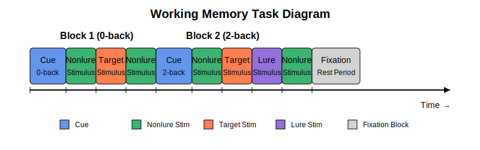
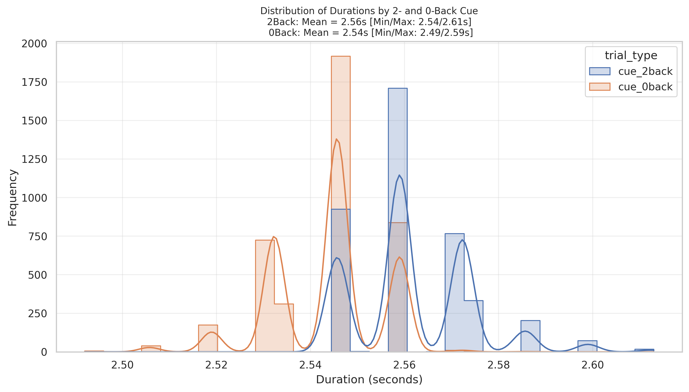
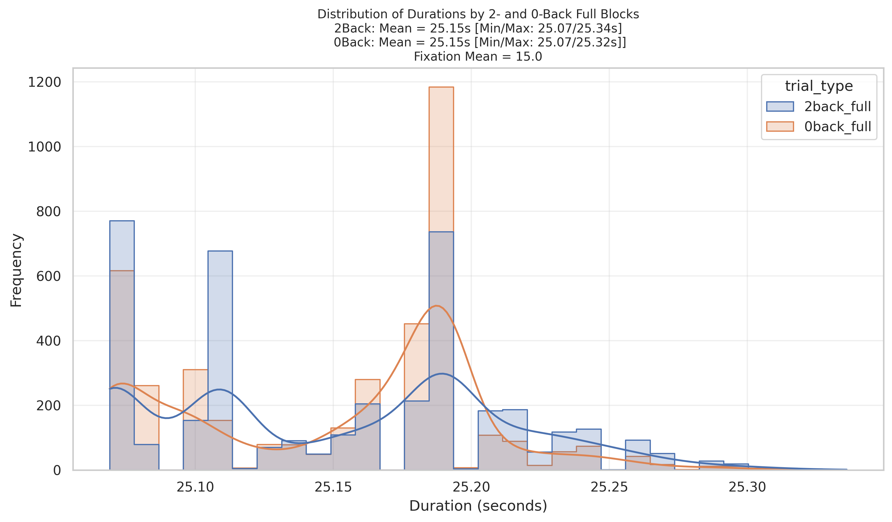
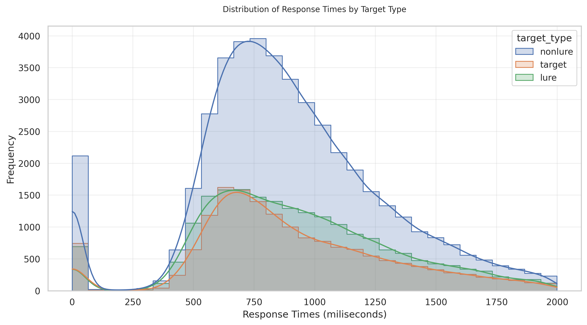
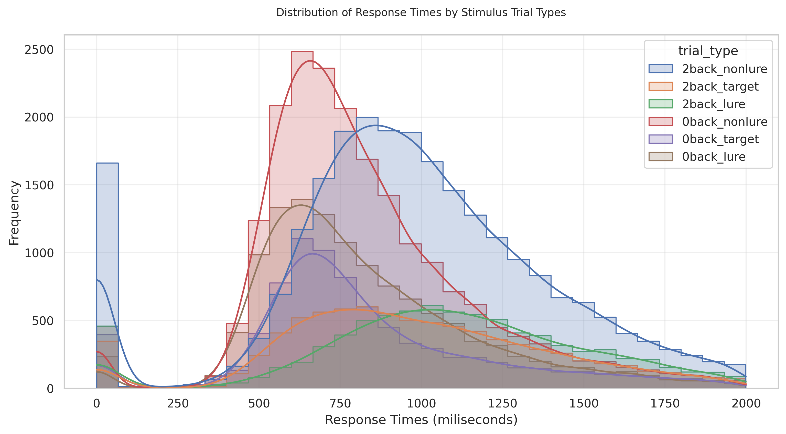
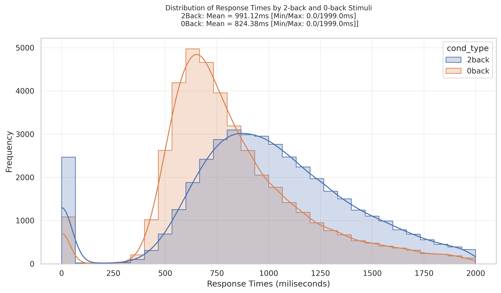
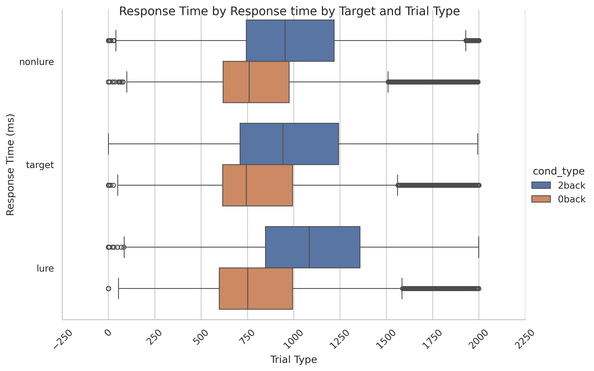
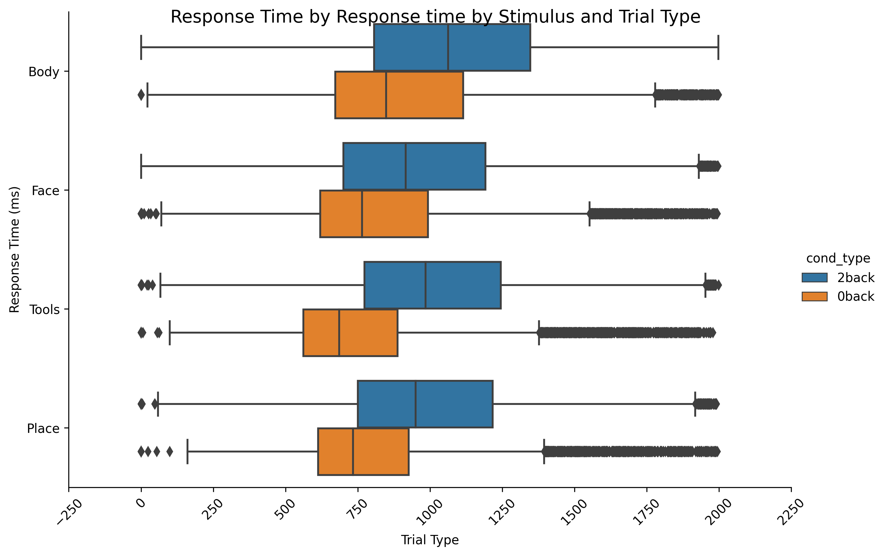

# Working Memory Task

## Summary of Task

The [Barch et al. (2013, pg 178)](https://www.sciencedirect.com/science/article/pii/S1053811913005272) highlights the Working Memory Task as:

"Recognition memory. After the participants exit the scanner from the session that includes the Working Memory tasks, they are given a “Remember, Know, New” item recognition test for the faces and places presented during the working memory task, as well as an equal number of new faces and places similar on visual characteristics (e.g., an equal number of old and new stimuli came from the same stimuli sets). We did not include body parts or tools as we did not have a sufficient number of unique stimuli to serve as “new” items. Responses to this recognition memory test can be used to segregate events to analyze the working memory trials as a function of whether the item was subsequently recognized (remember or know) or not (new), which is referred to as a subsequent memory analysis. Each item is presented for 2 s. There is then a 2 s ITI before the next stimulus. There are 48 old and 48 new stimuli (1/2 of each stimulus type). Please see the Supplemental materials for exact instructions. Data from this subsequent memory analysis will be presented in a future publication."

## Basic Trial Structure

The *WM task* starts with a cue indicating the *N-back condition* (0-back or 2-back).

Task Flow:
- After the cue block prompt, the *stimuli* for the N-back block begin.  The [4] Stimuli Blocks are:
  - Body
  - Face
  - Tools
  - Places
- Each block consists of consecutive stimuli, including [3] trial types:
  - non-lure 
  - target
  - lure  
- After the consecutive stimuli, the next block begins.

*Fixation Blocks*. After approximately two consecutive blocks, a fixation block occurs before the next N-back block.

See the diagram below for reference.

  

The distributions below are from Run 1 across **all available subjects and trials.**

### Distributions of Durations

First, the distribution of N-back cue durations

  

Second, the distribution of the full n-back block durations

  

### Distribution of Response Times

The distribution of response time target type.

  

Second, distribution of response times target ~ trial type.

  

Third, distribution of response times by n-back trial.

  

Fourth, histogram of response times by n-back and target type

  

Fifth, histogram of response times by n-back and stimulus type

  

## WM Task
### Labels
- **Procedure[Block]:** TRSyncPROC, Cue2BackPROC, TrialsPROC, Cue0BackPROC, Fix15secPROC
- **TargetType:** Nonlure, Target, Lure
- **StimType:** Body, Face, Tools, Place
- **Block-Type:** 2-Back, 0-Back

### Timings
- **SyncSlide.OnsetTime:** Initial TR 
- **Cue2Back.OnsetTime:** Onset of 2-Back
- **Stim.OnsetTime:** Stimulus onset 
- **Fix15sec.OnsetTime:** Fixation block 