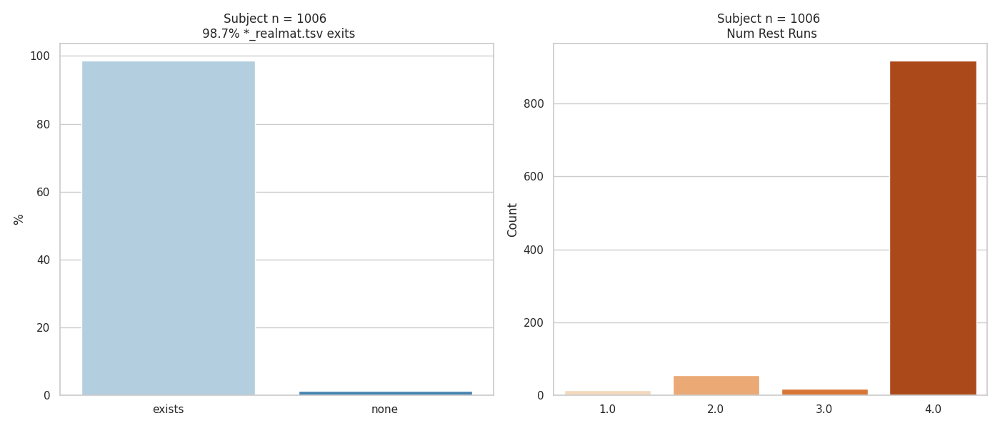
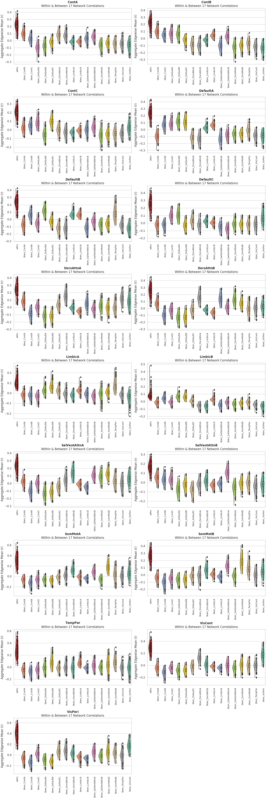
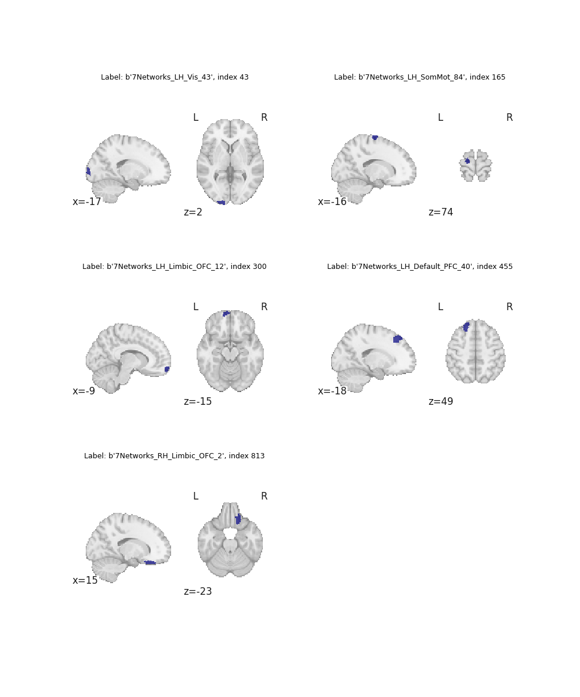
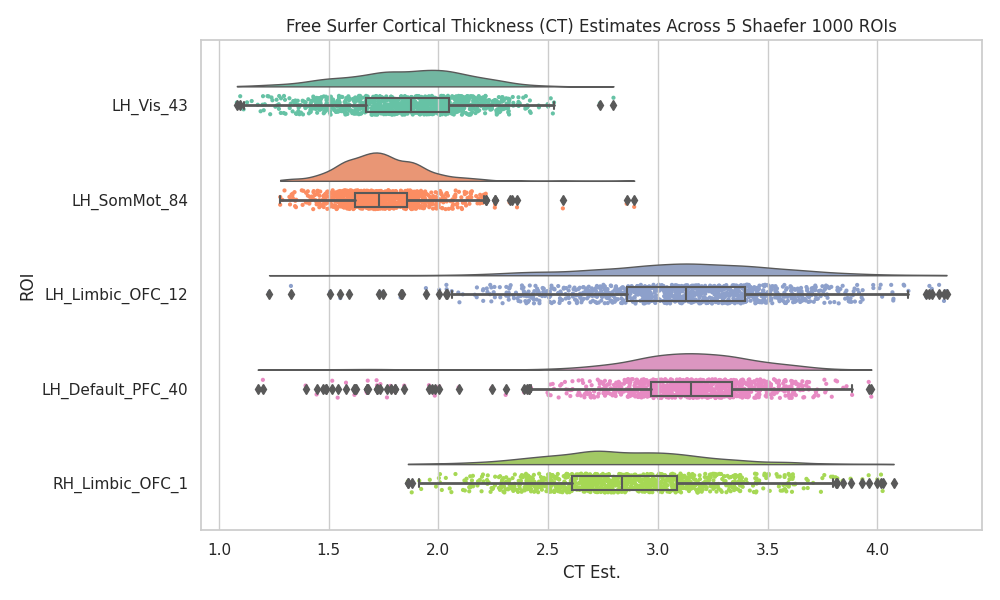

# ABCD-BIDS: XCP-D Post-processing Pipeline

This code is to run [XCP-D](https://xcp-d.readthedocs.io/en/latest/)] Post-processing. As described in [Mehta et al., 2024](https://doi.org/10.1162/imag_a_00257), XCP-D is a robust package for post-processing fMRI data, particularly resting state data. The software addresses the variability and reproducibility issues in existing in exist workflows in the field of fMRI. XCP-D supports multiple pre-processed formats: fMRIPrep, HCP and ABCD-BIDS. This allows application of denoising strategies across a range of datasets. It software is a collaborative effort between [PennLINC](https://www.pennlinc.io/) and the [CDNI](https://innovation.umn.edu/developmental-cognition-and-neuroimaging-lab/) lab, it features a modular Python codebase, integration with infant-fMRIPrep, and adherence to BIDS conventions. XCP-D introduces advanced features like surface-based analysis with CIFTI workflows, expanded quality measures, and detailed visual reports, ensuring stability through extensive CI testing. Distributed via Docker and Apptainer, XCP-D streamlines post-processing for reproducible and generalizable neuroimaging research.

The general overview:

- template.fmriprep
    - This is the template used to copy data to a tmp area to preprocess locally. It also includes the singularity run for XCP-D + the sync to s3
- resources_*.sh 
    - This is your research request for each XCP-D job that is submitted to slurm (takes 2-5hrs each)
- submit_*.sh 
    - jobs are submitted using arrays indicating the runs in `run_files.*` folder
    - to submit the first 100 subjs for independent slurm jobs use: ./submit_xcpd.sh 0-100

The XCP-D pile here only focuses on the `resting state` data and does not postprocess the task fMRI data. Note, teh [post-scrubbing threshold](https://xcp-d.readthedocs.io/en/latest/usage.html#:~:text=Default%3A%20auto-,%2D%2Dmin%2Dtime,-%2C%20%2D%2Dmin_time) is set to `0` due to issues related to not enough low-motion data in a run that is being concatenated (The default minimum is 4-minute, resulting in error: ValueError: QCPlots requires a value for input 'bold_file').

The singularity run is currently templated as:

```bash
singularity run --cleanenv \
    -B "${fmriprep_dir}:/fmriprep_dir" \
    -B "${data_dir}/processed/${xcpd_ver}/sub-${subj_id}_ses-${ses_id}:/output_dir" \
    -B "${data_dir}/work_dir/${xcpd_ver}/sub-${subj_id}_ses-${ses_id}:/wd" \
    -B "${freesurfer_license}:/opt/freesurfer/license.txt " \
    "${singularity_img}" \
    /fmriprep_dir /output_dir participant \
    --mode abcd \
    -m \
    --participant-label ${subj_id} \
    --task-id rest \
    --nthreads 8 \
    --omp-nthreads 3 \
    --mem-gb 100 \
    --min-time 0 \
    --lower-bpf 0.009 \
    --motion-filter-type notch --band-stop-min 12 --band-stop-max 18 \
    --clean-workdir \
    -vv \
    -w /wd

```

## XCP-D Output files

As described in [Mehta et al., 2024](https://doi.org/10.1162/imag_a_00257), XCP-D generates several files PER atlas.

### Functional Outputs Brief Notes

*Connectivity matrices for functional data:* "XCP-D extracts voxel-wise timeseries from the censored, denoised BOLD timeseries and outputs parcellated timeseries and correlation matrices for a variety of atlases bundled in the software." (pg. 14)

- <source_entities>_space–<label>_ seg–<label>_stat–pearsoncorrelation_relmat.tsv
- <source_entities>_space–fsLR_seg–<label>_den–91k_stat–pearsoncorrelation_relmat.tsv
- <source_entities>_space–fsLR_seg–<label>_den–91k_statpearsoncorrelation_boldmap.pconn.nii

*Mean timeseries:* "Before functional connectivity is estimated, any timeseries of all zeros (indicating voxels/vertices in the atlas that are not covered in the BOLD data) are replaced with NaNs, so that the mean timeseries from each parcel reflects the average of only covered voxels/vertices. The coverage threshold (with a default value of 0.5 or 50% coverage) applies to the warped versions of the atlasestherefore, if the normalization step removes a parcel, that parcel will contain NaNs in the parcellated timeseries." (pg 14)

- <source_entities>_space–<label>_ seg–<label>_stat–mean_timeseries.tsv 
- <source_entities>_space–fsLR_seg–<label>_den–91k_tstat–mean_timeseries.tsv 
- <source_entities>_space–fsLR_seg–<label>_den–91k_stat–mean_timeseries.ptseries.nii

*Outlier corrected BOLD file*: "After optional despiking, the BOLD data and confounds are fed into the interpolation workflow, in which highmotion outlier volumes are replaced with interpolated data.[...] These full-length timeseries can be leveraged for quality control to examine consistency in total run length across participants and to examine consistency of censored frames and artifacts in the Executive Summaries." (pg 13-14)
- <source_entities>_space–<label>_desc–interpolated_bold.nii.gz 
- <source_entities>_space–fsLR_den–91k_desc–interpolated_bold.dtseries.nii

*ReHO* and *ALFF* outputs
- ReHO: "Regional Homogeneity (ReHo) is a measure of local temporal uniformity in the BOLD signal computed at each voxel of the processed image. Greater ReHo values correspond to greater synchrony among BOLD activity patterns measured in a local neighborhood of voxels (Zang etal., 2004). ReHo is calculated as the coefficient of concordance among all voxels in a sphere centered on the target voxel (Zuo etal., 2013)... ReHo is performed on the denoised BOLD file, and the output is written out directly to the XCP-D derivatives folder." (pg 15)
    - ./func/<source_entities>_space–<label>_seg–<label>_stat–reho_bold.tsv 
    - ./func/<source_entities>_space–fsLR_seg–<label>_stat–reho_bold.tsv
- ALFF: "amplitude of low-frequency fluctuations (ALFF) also called “fluctuation amplitude”—is a measure of regional intensity of BOLD signal fluctuation. ALFF is only calculated if band-pass filtering is applied. ALFF is computed by transforming the processed BOLD timeseries to the frequency domain" (pg. 15)
    - ./func/<source_entities>_space–<label>_ stat–alff_boldmap.nii.gz
    - ./func/<source_entities>_space–fsLR_den–91k_stat–alff_boldmap.dscalar.nii
    - ./func/<source_entities>_space–<label>_stat–alff_desc–smooth_boldmap.nii.gz
    - ./func/<source_entities>_space–fsLR_den–91k_stat– alff_desc–smooth_boldmap.dscalar.nii
    - ./func/<source_entities>_space–<source_entities>_space–<label>_seg–<label>_stat–alff_bold.tsv
    - ./func/<source_entities>_space–fsLR_seg–<label>_stat–alff_bold.tsv

### Anatomical outputs
 
*Sulcal depth/curvature and Cortical Thickness: "CP-D will parcellate morphometric surface files—including cortical thickness, depth, and curvaturegenerated in pre-processing by Freesurfer (Fischl, 2012), sMRIPrep (Esteban et al., 2020), and/or HCP (Glasser etal., 2013) pipelines. XCP-D parcellates these morphometric files using the same atlases that are used for creating functional connectivity matrices as well as other surface features like ALFF and ReHo. This functionality facilitates analyses of both fMRI and structural imaging features when data are processed using XCP-D." (pg. 16)
- Depth
    - ./anat/<source_entities>_space–fsLR_ den–32k_hemi–<L|R>_sulc.shape.gii
    - ./anat/<source_entities>_space–fsLR_ seg–<label>_den–32k_stat–mean_desc–sulc_morph.tsv
- Curvature 
    - ./anat/<source_entities>_space–fsLR_ den–32k_hemi–<L|R>_curv.shape.gii
    - ./anat/<source_entities>_space–fsLR_seg–<label>_den–32k_stat–mean_desc–curv_morph.tsv
- Cortical thickness 
    - ./anat/<source_entities>_space–fsLR_ den–32k_hemi–<L|R>_thickness.shape.gii
    - ./anat/<source_entities>_space–fsLR_seg–<label>_den–32k_stat–mean_desc–thickness_morph.tsv
    
## XCP-D Automated QC

XCP-D generates numerous files for each of the selected parcels. The number of resting state BOLD runs varies across subjects. If a subject has only a single BOLD run, a concatenated Pearson correlation FC (*pearsoncorrelation_relmat*) is not generated. The figure below summarizes two key values: the number of BOLD runs per subject and the percentage of subjects with a correlation matrix estimate.

<div style="text-align: center;">
  
</div>

### Within & Between Network Edge FC 

When Pearson correlation matrices are available, the aggregate within-network and between-network edgewise correlations are computed for each subject. This allows for a quick comparison of the brain’s network connectivity. Generally, within-network connectivity should be greater than between-network connectivity. While this is a crude metric, it can serve as an initial prompt for identifying potential subjects with bad data/maps.

<div style="text-align: center;">
  
</div>

### Cortical Thickness Distribution

Cortical thickness estimates are extracted from five specific regions near the borders of cortical areas, which are prone to Freesurfer processing issues. These regions may exhibit inaccurate estimates or artifacts. 

These distributions should not be used as the sole indicator of "quality data," but rather as a quick reference to identify subjects that may need further examination.

<div style="text-align: center;">
  
</div>

The figure below illustrates the distribution of cortical thickness estimates for these regions.

<div style="text-align: center;">
  
</div>


